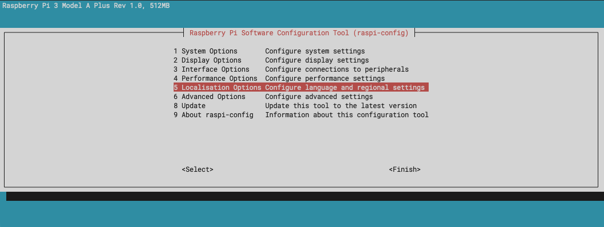
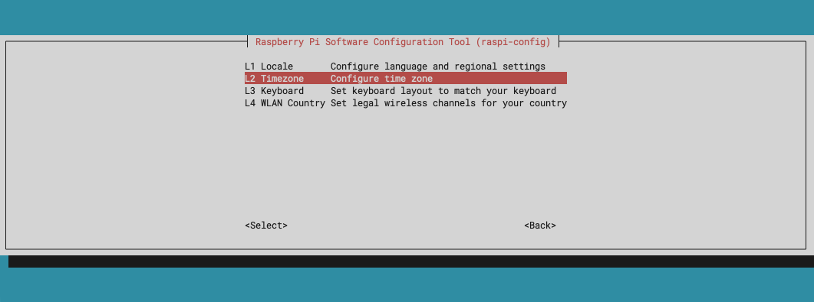
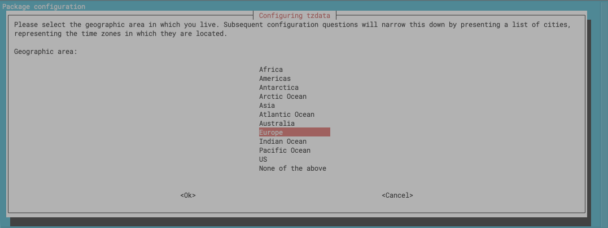
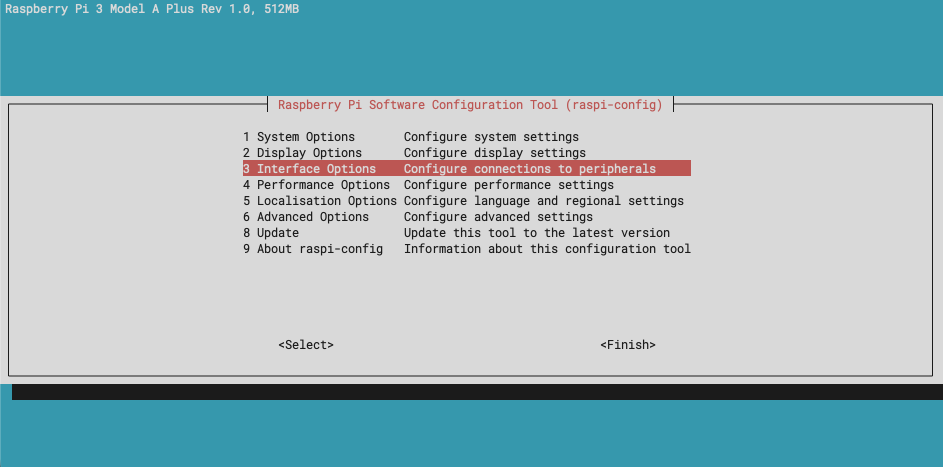
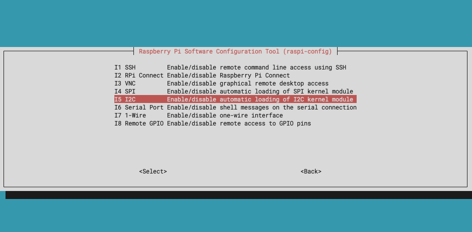
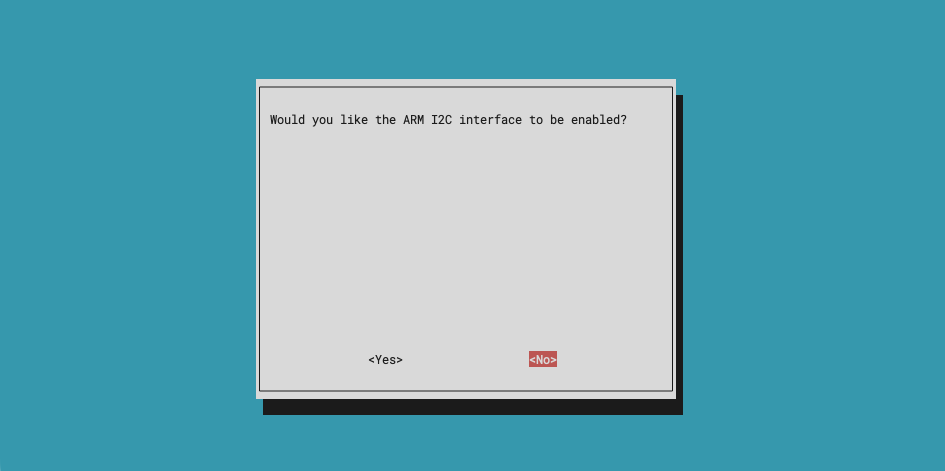
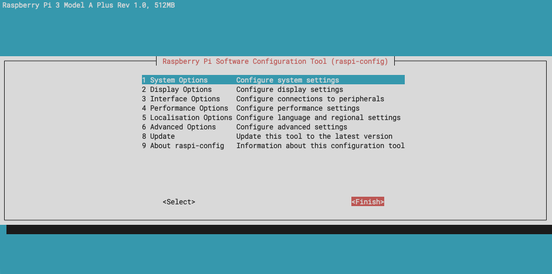

# README

## ToDo

- WIP: Main README Docu ... 🟠
- WIP: All code base cleanup - System provisioning docu and tooling .... 🟠
- Web ui Monitor 🟠
- Setup script 🔴
- Along-side drop box do a freesound.org upload ... 
- Other region of news 

- Hardware Update Steps: 🔴
  - Speaker Switch switcher 
  - Update circuit 
  - Place new order for SLA prints 
  - Print PLA locally 
  - Assemble new one ... 
---

## Project structure

```txt
├── README.md
├── PI-POSTBOOT-SETUP.md
├── LICENSE
├── assets/
├── lib/
│   ├── hardware_player.py
│   ├── radar_controller.py
│   ├── __init__.py
│   ├── llm_analyzer.py
│   ├── music_generator.py
│   ├── music_post_processor.py
│   ├── news_fetcher.py
│   ├── player.py
│   └── settings.py
├── llm_agents/
│   ├── __init__.py
│   ├── musicgen_prompt_crafter.py
│   ├── news_analyzer.py
├── logs/
│   ├── cron.log
│   ├── full_cycle_btn.log
│   ├── player_service.log
│   └── world_theme_music_player.log
├── music_generated/
│   └── generated_music_will_go_here
├── prompts/
│   ├── musicgen_prompt_crafter_system.md
│   └── news_analyzer_system.md
├── pyproject.toml
├── uv.lock
├── news_config.json
├── settings.json
├── main.py
├── run_full_cycle_btn.py
├── run_player.py
├── keep_audio_ch_active.wav
├── services/
│   ├── full-cycle-btn.service
│   └── music-player.service
├── tests/
│   ├── 01_test_IOs.py
│   ├── 02_test_event_radar.py
│   ├── 02_test_serial_radar.py
│   └── 03_test_serial_radar_as_event.py
└── tools/
    └── bkp_gen_music.py
```

---

## Pi Setup

### Setup your pi time correct to region

First check your pi's current date and time 

```bash
date
```

If it is off, you can fix it via `raspi-config`

```bash
sudo raspi-config
```

| Steps | View |
| --- | --- |
| Select "Localisation Options" and hit ENTER |  |
| Select "Timezone" and hit ENTER |  |
| Select your region and follow the prompts |  |

Once happy, 'tab' to `<Finish>` and restart (`sudo reboot`)

---

### Install Python Build Dependencies

```bash
sudo apt update -y
sudo apt upgrade -y 
sudo apt install git -y 
sudo apt install build-essential libssl-dev zlib1g-dev libbz2-dev libreadline-dev libsqlite3-dev curl libncursesw5-dev xz-utils tk-dev libxml2-dev libxmlsec1-dev libffi-dev liblzma-dev jq tree -y
sudo apt install python3-dev -y
```

### Install Audio deps

```bash
sudo apt-get install libportaudio2 -y
```

### Install UV

```bash
curl -LsSf https://astral.sh/uv/install.sh | sh
```

### GPIO permissions

```bash
sudo usermod -a -G gpio $USER
sudo reboot
```

---

## Project setup

1. git clone
2. `uv sync`
3. sometimes may need: `uv pip install RPi.GPIO --break-system-packages` from project dir...

### Create necessary API keys and Access Tokens

```bash
cp .env.template .env
```

1. Update `NEWS_API_KEY`:
   1. It is used to fetch news from various regions of the world
   2. Create an account here: https://newsapi.org/account
   3. Then generate an API KEY
   4. Replace `"REPLACE_WITH_YOUR_NEWS_API_KEY_HERE_FROM"` with your NEW KEY. 
2. Update `REPLICATE_API_TOKEN`:
   1. We are using https://replicate.com/ to use a Open Source LLM (meta/meta-llama-3-70b-instruct) and an Open Source music gen model (meta/musicgen)
   2. Create an account here: https://replicate.com/account
   3. Setup billing here: https://replicate.com/account/billing (_Yes you would need a credit card but the cost is in pennies and the models only run once per day, once the system is setup and is up and running_)
   4. And generate an API KEY here: https://replicate.com/account/api-tokens
   5. Replace `"REPLACE_WITH_YOUR_REPLICATE_API_TOKEN_HERE"` with your NEW KEY. 
   6. (Optional) If you are curious, you can check out and test the models (for fun), from here (https://replicate.com/meta/meta-llama-3-70b-instruct) and here (https://replicate.com/meta/musicgen) 
3. Update Dropbox Backup: TBD

---

## Run

### Test the Song Generator

```bash
uv run python main.py --fetch true --play false
```

### Test the Hardware Player

```bash
uv run python run_player.py
```

Or in daemon mode (no keyboard interaction):

```bash
uv run python run_player.py --daemon
```

---

## Run as Services (systemd)

### Music Player Service

```bash
cp services/music-player.service ~/.config/systemd/user/
systemctl --user daemon-reload
systemctl --user enable music-player.service
systemctl --user start music-player.service
```

Check status:
```bash
systemctl --user status music-player.service
```

Check logs:
```bash
tail -f logs/player_service.log
```

### Full Cycle Button Service

```bash
cp services/full-cycle-btn.service ~/.config/systemd/user/
systemctl --user daemon-reload
systemctl --user enable full-cycle-btn.service
systemctl --user start full-cycle-btn.service
```

Check status:
```bash
systemctl --user status full-cycle-btn.service
```

### Enable Linger (services run without login)

```bash
sudo loginctl enable-linger pi
```

---

## Scheduled Tasks (cron)

### Daily song generation

```bash
crontab -e

# Add:
0 3 * * * cd /home/pi/daily_mood_theme_song_player && /home/pi/.local/bin/uv run python main.py --fetch true --play false >> /home/pi/daily_mood_theme_song_player/logs/cron.log 2>&1
```

### Backup generated music files

```bash
crontab -e

# Add:
40 2 * * * cd /home/pi/daily_mood_theme_song_player && /home/pi/.local/bin/uv run python tools/bkp_gen_music.py >> /home/pi/daily_mood_theme_song_player/logs/backup.log 2>&1
```

**Why this order?**

- `2:40 AM` — Backup runs: syncs existing files to Dropbox, cleans up if > `100MB`
- `3:00 AM` — Generator runs: creates new song in clean folder

This ensures all old songs are backed up before cleanup, and the new song has space.

List all cron jobs:
```bash
crontab -l
```

---

## Radar Configuration

The player supports two radar models for motion-triggered playback:

| Setting | RCWL-0516 | RD-03D |
|---------|-----------|--------|
| Interface | GPIO | Serial |
| Detection | Presence | Movement (Doppler) |
| Range config | N/A | `radarMaxRangeMeters` |

Configure in `settings.json`:
```json
{
  "inputPins": {
    "radarModel": "RCWL-0516",
    "radarPin": 16,
    "radarEnablePin": 6
  },
  "hwFeatures": {
    "motionTriggeredPlaybackDurationSec": 1800,
    "cooldownAfterUserActionSec": 60,
    "radarMaxRangeMeters": 2.5,
    "radarTargetTimeoutSec": 1.0
  }
}
```

**Behavior:**
- Radar switch ON (GPIO6) → Motion triggers playback
- Auto-stop after configured duration (default 30 min)
- Cooldown after user pause/stop (default 60s)
- User can always pause/stop with button or keyboard

---

## Hardware Setup

### Setup Button based shutdown and wake-up

#### Disable I2C

>[!Warning]
> For this step we need to disable `I2C` as we will be using `GPIO3` (based on Kernel) which is the I2C's `SCL` line using `sudo raspi-config`

| Steps | View |
| --- | --- |
| 1. Open raspi-config & Select *Interface Options* |  |
| 2. Select I2C Option |  |
| 3. Disable it (Select *No*) |  |
| 4. Then hit *Finish* and Reboot |  |

### Update dtoverlay to allow button ctrl for boot management

Add the following in the `/boot/firmware/config.txt`

```bash
sudo nano /boot/firmware/config.txt
```

Then, after these two lines ...

```bash
# ...
# Additional overlays and parameters are documented
# /boot/firmware/overlays/README
# ...
```

Add ...

```bash
dtoverlay=gpio-shutdown
```

So it now looks like this:

```bash
# ...
# Additional overlays and parameters are documented
# /boot/firmware/overlays/README
dtoverlay=gpio-shutdown
# ...
```

Reboot & Test. 

Now after pi boots, if you press the GPIO3 button, it will go to sleep and if you press again GPIO 3, it will boot back up.  

---

## LICENSE

[unlicense](LICENSE)
