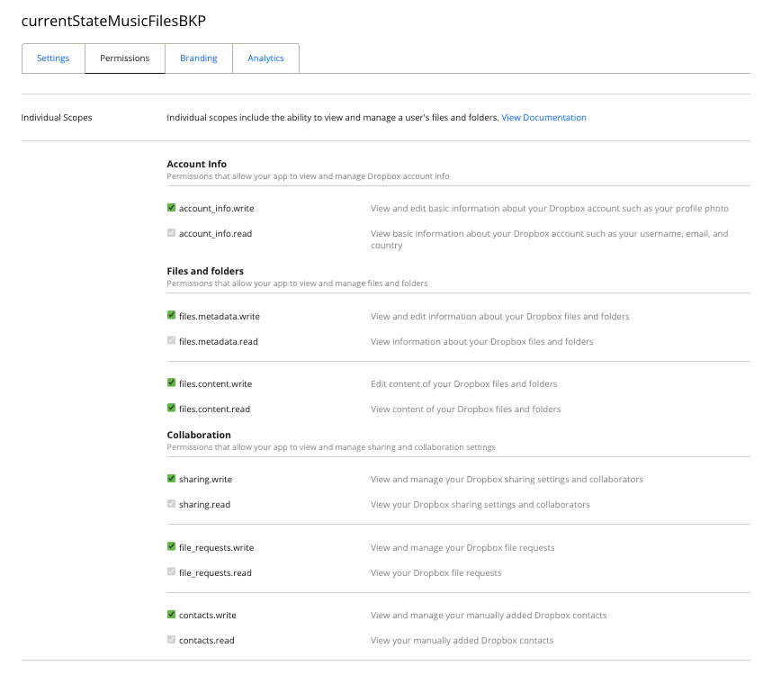
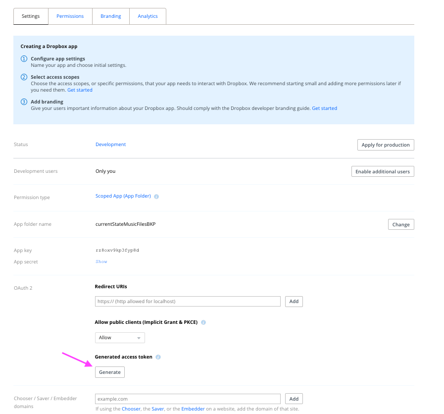

# README

## ToDo

### Low

- WIP: Docu ...
- WIP: All code base cleanup - System provisioning docu and tooling ....
- maybe web ui
- SfX with music
- Other region of news 

### High

- Business logic of operation ... (radar trigger )
- Improve music prompt gen algo

### Backlog

- ~~How often and how long silent audio player plays~~
  - silent audio to keep the channel active did not work ... so implement HW sol to trigger Audio On on FREKVENS
- ~~Currently happy with the implementation~~
- ~~Send cancel to other agent calls~~
- ~~slow down track for 30 sec to make it feel longer [post processing]~~

---

## Project structure

```txt
├── README.md
├── PI-POSTBOOT-SETUP.md
├── LICENSE
├── assets/
├── lib/
│   ├── hardware_player.py
│   ├── __init__.py
│   ├── llm_analyzer.py
│   ├── music_generator.py
│   ├── music_post_processor.py
│   ├── news_fetcher.py
│   ├── player.py
│   └── settings.py
├── llm_agents/
│   ├── __init__.py
│   ├── musicgen_prompt_crafter.py
│   ├── news_analyzer.py
├── logs/
│   ├── this_is_where_the_logs_will_go
│   ├── cron.log
│   ├── full_cycle_btn.log
│   ├── player_service.log
│   └── world_theme_music_player.log
├── music_generated/
│   └── generated_music_will_go_here
├── prompts/
│   ├── musicgen_prompt_crafter_system.md
│   └── news_analyzer_system.md
├── pyproject.toml
├── uv.lock
├── news_config.json
├── settings.json
├── main.py
├── run_full_cycle_btn.py
├── run_player.py
├── Dockerfile
├── keep_audio_ch_active.wav
├── services/
│   ├── full-cycle-btn.service
│   └── music-player.service
├── tests
│   ├── 01_test_IOs.py
│   ├── 02_test_event_radar.py
│   └── 02_test_serial_radar.py
├── tools
│   └── bkp_gen_music.py
└── news_data_2026-01-07.json
```

### Setup your pi time correct to region

First check your pi's current date and time 

```bash
date
```

If it is off, you can fix it via `raspi-config`

```bash
sudo raspi-config
```

| Steps | View |
| --- | --- |
| Select "Localisation Options" and hit ENTER |  |
| Select "Timezone" and hit ENTER |  |
| Select your region and follow the prompts |  |

Once happy, 'tab' to `<Finish>` and restart (`sudo reboot`)

---


### Install Python Build Dependencies:

```bash
sudo apt update -y
sudo apt upgrade -y 
sudo apt install git -y 
sudo apt install build-essential libssl-dev zlib1g-dev libbz2-dev libreadline-dev libsqlite3-dev curl libncursesw5-dev xz-utils tk-dev libxml2-dev libxmlsec1-dev libffi-dev liblzma-dev jq tree -y
sudo apt install python3-dev -y
```

### Install Audio deps

```bash
sudo apt-get install libportaudio2 -y
```

### Install UV

```bash
curl -LsSf https://astral.sh/uv/install.sh | sh
```

### Install docker

https://docs.docker.com/engine/install/raspberry-pi-os/


### Some permissions

```bash
sudo usermod -a -G gpio $USER
sudo reboot
```


## Project setup

1. git clone
2. uv sync
3. sometimes may need: `uv pip install RPi.GPIO` from project dir...

### Create necessary API keys and Access Tokens

```bash
cp .env.template .env
```

1. Update `NEWS_API_KEY`:
   1. It is used to fetch news from various regions of the world
   2. Create and account here: https://newsapi.org/account
   3. Then generate an API KEY
   4. Replace `"REPLACE_WITH_YOUR_NEWS_API_KEY_HERE_FROM"` with your NEW KEY. 
2. Update `REPLICATE_API_TOKEN`:
   1. We are using https://replicate.com/ to use a Open Source LLM (meta/meta-llama-3-70b-instruct) and an Open Source music gen model (meta/musicgen)
   2. Create and account here: https://replicate.com/account
   3. Setup billing here: https://replicate.com/account/billing (_Yes you would need a credit card but the cost is in pennies and the models only run once per day, once the system is setup and is up and running_)
   4. And generate an API KEY here: https://replicate.com/account/api-tokens
   5. Replace `"REPLACE_WITH_YOUR_REPLICATE_API_TOKEN_HERE"` with your NEW KEY. 
   6. (Optional) If you are curious, you can check out and test the models (for fun), from here (https://replicate.com/meta/meta-llama-3-70b-instruct) and here (https://replicate.com/meta/musicgen) 
3. Update `DROPBOX_ACCESS_TOKEN`:
   1. We use it to back up old gen music audio files. Of-course you would need a drop box account. Periodically old files are removed from disk to save space in the RPI. _If you want to manually do it and opt out from this dropbox matter, you can do so by following the instructions from [here](#gen-music-file-size-management)_
   2. Assuming you have a dropbox account, create a new empty folder in your dropbox's home directory and rename it to `currentStateMusicFilesBKP` (NAME MUST BE EXACT)
   3. Go to the [dev app console](https://www.dropbox.com/developers/apps?_tk=pilot_lp&_ad=topbar4&_camp=myapps) and create a new app called `currentStateMusicFilesBKP` (NAME MUST BE EXACT)
   4. Enable all permissions.
     
   5. And settings should look like below. Under `OAuth 2`, hit the "Generate" button and copy the KEY. 
    
   6. Replace the `"REPLACE_WITH_YOUR_DROPBOX_ACCESS_TOKEN_HERE"`, in the .env file, with your KEY. 


---

### Run tests

From `world_theme_music_player`, run:

```bash
uv run -m tests.test_analyzer
uv run -m tests.test_grab_news
```

## Run

```bash
uv run main.py --fetch True --analyze True --verbose True
```

... WIP

WIP Pinouts ... 

...

DOCKER
...

Build 

```bash
docker build -t world-theme-music .
```

docker build: The command to build an image from a Dockerfile.

-t world-theme-music: This "tags" (or names) our new image world-theme-music, which is how we'll refer to it later.

.: This tells Docker to look for the Dockerfile in the current directory.

This process will take a few minutes as it downloads the base image and installs all the dependencies. Once it finishes successfully, you will have a self-contained, ready-to-use image of your application. We can then proceed to the next step: testing it.

### Test the Song Generator

```bash
docker run --rm -it \
  --dns=8.8.8.8 \
  -v ./music_generated:/app/music_generated \
  -v ./news_data_cache:/app/news_data_cache \
  -v ./logs:/app/logs \
  --env-file .env \
  world-theme-music \
  uv run python main.py --fetch true --play false
```

- `docker run`: The command to start a new container.
- `--rm`: This is a cleanup flag. It automatically removes the container after it exits, which is perfect for our temporary generation task.
- `-it`: This runs the container in "interactive mode," which allows you to see the script's output (the logs) in your terminal.
- `-v ./music_generated:/app/music_generated`: This is very important. It creates a "volume," which syncs the music_generated folder on your Pi with the /app/music_generated folder inside the container. This allows the container to save the newly created song directly onto your Pi's filesystem.
- `-v ./news_data_cache:/app/news_data_cache`: This does the same for a new cache directory, so your news data isn't re-downloaded every time if you don't use --fetch true.
- `--env-file .env`: This securely passes your API keys from your local .env file into the container so the script can access them.
- `world-theme-music`: This is the name of the image we're using.
- `python main.py --fetch true --play false`: This is the command that will be executed inside the container.


### Test the Hardware Player

```bash
docker run --rm -it \
  --dns=8.8.8.8 \
  --privileged \
  -v /dev/snd:/dev/snd \
  -v ./music_generated:/app/music_generated \
  -v ./logs:/app/logs \
  world-theme-music
```

- `--device /dev/snd`: This gives the container direct access to your Raspberry Pi's sound card.

or in daemon mode (no keyboard interaction....  )

```bash
docker run --rm --name world-theme-player \
  --privileged \
  -v /dev/snd:/dev/snd \
  -v ./music_generated:/app/music_generated \
  -v ./logs:/app/logs \
  world-theme-music \
  uv run python run_player.py --daemon
```


### Run as a service 

music player 

[music-player.service](music-player.service)

check logs:

```bash
docker logs -f world-theme-player
```

---

>[!Note]

### Docker cleanup 

```bash
# Remove dangling images (partial builds)
docker image prune

# If you want to also remove unused build cache
docker builder prune

# Nuclear option — remove ALL unused stuff (images, containers, networks, cache)
docker system prune -a
```

---

### Run cron for fetcher and generator ...

```bash
crontab -e

# Select nano as the editor
# Then at the bottom, add:
0 3 * * * /usr/bin/docker run --rm --name world-theme-generator --dns=8.8.8.8 -v /home/pi/daily_mood_theme_song_player/music_generated:/app/music_generated -v /home/pi/daily_mood_theme_song_player/news_data_cache:/app/news_data_cache -v /home/pi/daily_mood_theme_song_player/logs:/app/logs --env-file /home/pi/daily_mood_theme_song_player/.env world-theme-music uv run python main.py --fetch true --play false >> /home/pi/daily_mood_theme_song_player/logs/cron.log 2>&1
```

### gen music file size management

TBD 

```bash
crontab -e

# Select nano as the editor
# Then at the bottom, add:
40 2 * * * cd /home/pi/daily_mood_theme_song_player && /home/pi/.local/bin/uv run python tools/bkp_gen_music.py >> /home/pi/daily_mood_theme_song_player/logs/backup.log 2>&1
```

Why this order?

- `2:40 AM` — Backup runs: syncs existing files to Dropbox, cleans up if > `100MB`
- `3:00 AM` — Generator runs: creates new song in clean folder

This ensures all old songs are backed up before cleanup, and the new song has space.

List all cron jobs:

```bash
crontab -l
```

...

TBD 

...

---


### Setup Button based shutdown and wake-up

#### Disable I2C

>[!Warning]
> For this step we need to disable `I2C` as we will be using `GPIO3` (based on Kernel) which is the I2C's `SCL` line using `sudo raspi-config`

| Steps | View |
| --- | --- |
| 1. Open raspi-config & Select *Interface Options* |  |
| 2. Select I2C Option |  |
| 3. Disable it (Select *No*) |  |
| 4. Then hit *Finish* and Reboot |  |

### Update dtoverlay to allow button ctrl for boot management

Add the following in the `/boot/firmware/config.txt`

```bash
sudo nano /boot/firmware/config.txt
```

Then, after these two lines ...

```bash
# ...
# Additional overlays and parameters are documented
# /boot/firmware/overlays/README
# ...
```

Add ...

```bash
dtoverlay=gpio-shutdown
```

So it now looks like this:

```bash
# ...
# Additional overlays and parameters are documented
# /boot/firmware/overlays/README
dtoverlay=gpio-shutdown
# ...
```

Reboot & Test. 

Now after pi boots, if you press the GPIO3 button, it will go to sleep and if you press again GPIO 3, it will boot back up.  


---

## LICENSE

[unlicense](LICENSE)


