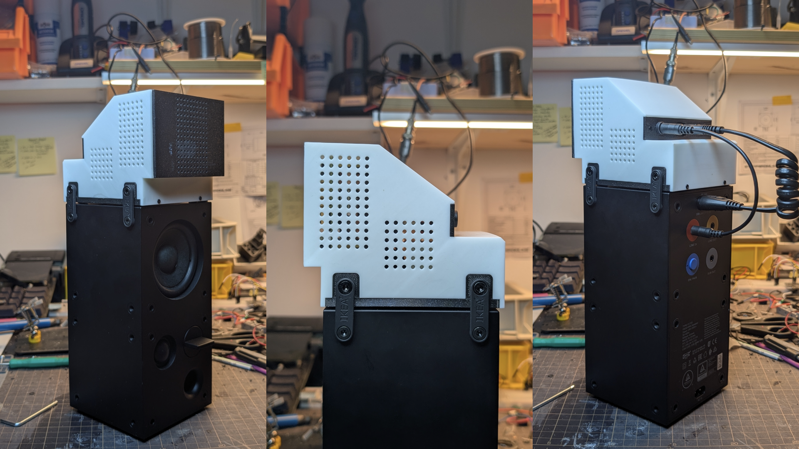
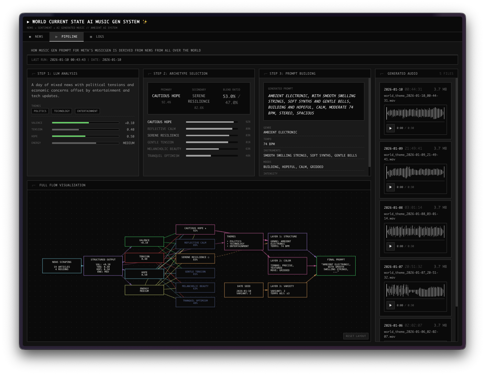
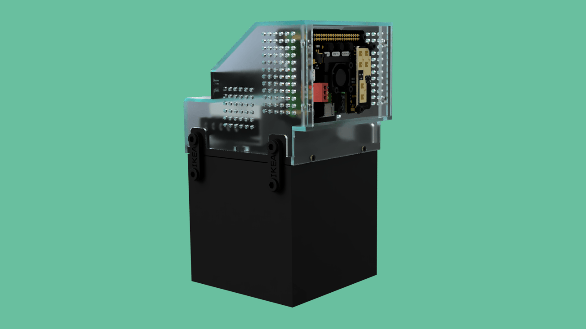
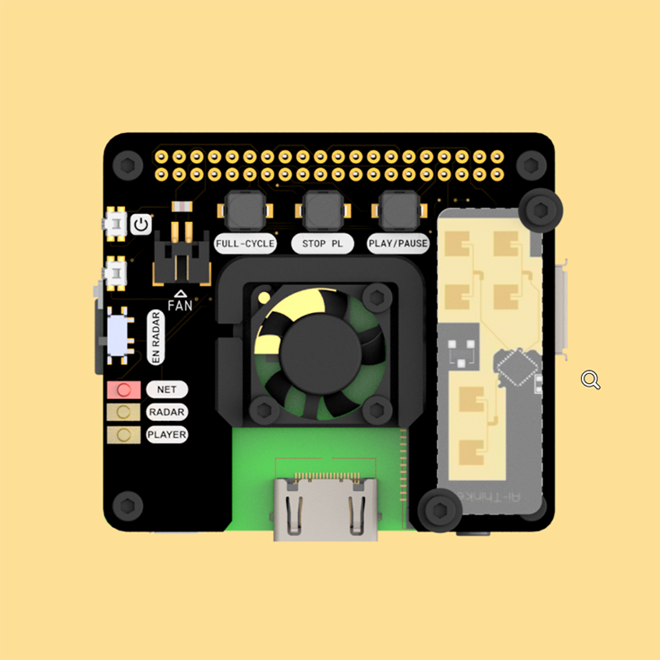
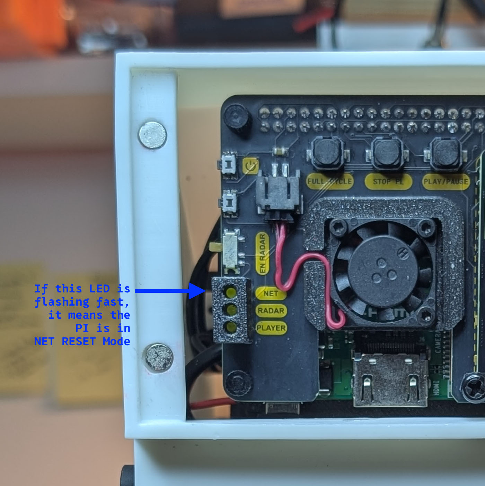
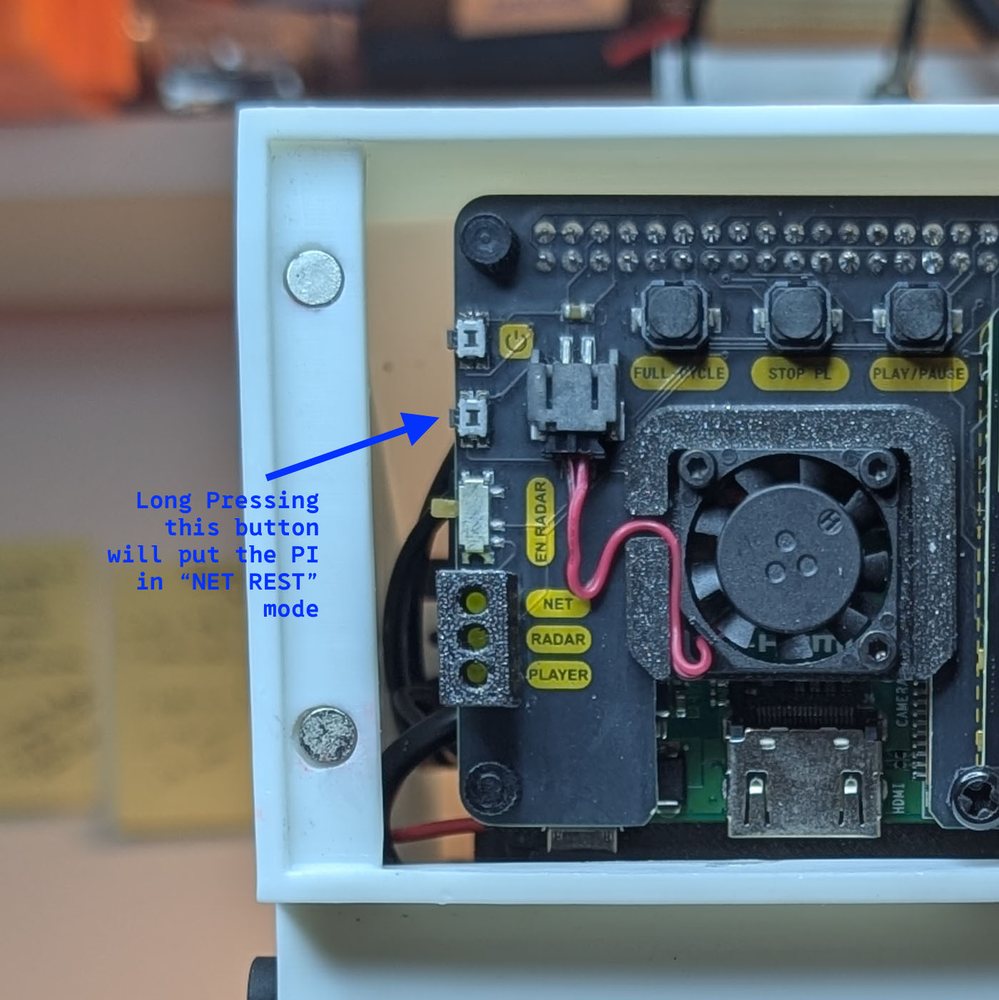

# World Theme Music Player

[](LICENSE)
[](https://www.raspberrypi.org/)
[](https://www.python.org/downloads/)

<p align="left">
  If you find this project useful, consider supporting its development <br><br>
  <a href="https://github.com/sponsors/dattasaurabh82">
    
  </a>
  <a href="https://buymeacoffee.com/dattasaurabh82">
    
  </a>
</p>

---
<br>

> **An AI-powered ambient music generator that transforms daily world news into mood-based soundscapes. Designed to sit on top of IKEA FREKVANS SPEAKERS, this will trigger playback of AI generated soundscape/music when a person enters a room or a motion is detected. So a suitable place for this are contemplation rooms like bathrooms 🙃**

<br>



*What does it look like?*

 

*Monitor Web Dashboard*

The main functionality of the system is to fetch news headlines from multiple regions, analyze their emotional tone using an LLM, select musical archetypes, and generate unique ambient music — all running autonomously on a Raspberry Pi using open-source LLM models hosted on [Replicate](https://replicate.com/). 
With onboard hardware buttons, all functionalities can be triggered and controlled. For example,  disabling radar trigger or shutting down or turning ON the PI or even resetting WiFi for the PI, can all be carried out via the custom PI HAT I designed! (More on that later ...) 

---

## Table of Contents

- [What it does (Summary)?](#what-it-does-summary)
- [Other features](#other-features)
- [What can you do?](#what-can-you-do)
- [How It Works](#how-it-works)
- [Prerequisites](#prerequisites)
  - [Hardware](#1-hardware)
  - [API Accounts](#2-api-accounts)
- [Summary of steps to take](#summary-of-steps-need-to-take-action)
  - [Step 1: Mandatory Update](#step-1-installation-and-basic-setup-mandatory-update)
  - [Step 2: Configuration Reference](#step-2-installation-and-basic-setup-understand-the-configuration-reference)
  - [Step 3: Run Setup Script](#step-3-run-setup-script)
  - [Step 4: Hardware Testing](#step-4-hardware-testing)
  - [Step 5: Installing WiFi Manager](#step-5-installing-wifi-manager)
  - [Step 6: Test Full Pipeline](#step-6-test-full-pipeline)
  - [Step 7: Services Installation](#step-7-services-installation)
- [Web Dashboard](#web-dashboard)
- [Project Structure](#project-structure)
- [License](#license)
- [Supporting Docs](#supporting-docs)
- [Manual Setup (Archive)](#archive-manual-setup-instructions)
- [TODO](#todo)

---

## What it does (Summary)?

- Every night at 3:00 AM, scrapes news and generates a 30-second ambient music piece based on world sentiment (and various other factors)
- Then, if the device detects presence of a person (also notified via LED), it plays back that music in a loop for a predefined time (currently set to 5 mins) and then stops
- While music is playing, the LED is ON. While paused, it turns OFF
- It serves a web monitor where you can see:
  - News Tab: News that were collected
  - Pipeline Tab: view explaining how music was then generated including Music files too
  - Logs Tab: of all process for live preview and debugging of any steps
- If fails to connect to Wifi, it blinks and notifies you
- If any step in the full pipeline (news scraping -> music generation) it shows in logs and if radar detection is disabled the LED also notifies you with blinks

## Other features

- Smart log management and lot of configuration settings
- It also comes with smart installation and uninstallation scripts, detailed documentation and maintenance instructions
- **Optional and not included in documentation**, but it can automatically upload music and crucial data for future analysis, to drop box as well as locally

## What can you do?

- With the press of a button you can turn the system on & off
- With the press of a button you can headlessly setup it's wifi, over a browser
- You can manually trigger the full pipeline: news scraping -> music generation
- You can play/pause and stop the music with buttons
- You can enable or disable radar detection
- You can run tests to understand how the pipeline works
- **Optional and not included in documentation**, but you can also manually backup with a single cmd or set it to do it automatically 

## How It Works

The system has two modes of operation:


### Pipeline Overview

The **automated pipeline** runs daily at 3:00 AM:

> [!Note]
> This 3:00 AM is defined in cronjob settings which can be manually altered but it is defined in the [services/01_install_and_start_services.sh](services/01_install_and_start_services.sh)

| Stage | What Happens |
|-------|--------------|
| **Fetch** | NewsAPI provides headlines in 4 languages (EN, DE, FR, ES) — 4 API requests total |
| **Analyze** | Llama 3 70B extracts mood: valence (-1 to +1), tension (0-1), hope (0-1), energy level |
| **Select** | Rule-based scoring matches the mood profile to one of 6 musical archetypes |
| **Build** | Three-layer prompt construction: archetype structure + theme textures + daily variety |
| **Generate** | MusicGen stereo-melody-large creates a 30-second ambient piece |
| **Process** | Fade-in (1.5s) and fade-out (2s) are applied |

The **user-triggered interactions** happen via hardware:

| Trigger | Action |
|---------|--------|
| **GPIO17 Button** | Manually triggers the full news→music pipeline |
| **Radar Motion** | Starts looping playback when presence is detected (see [Radar Behavior](#radar-behavior)) |
| **Radar Enable Switch** | GPIO6 toggle — when ON, radar controls playback; when OFF, radar is ignored |
| **Play/Pause Button** | Toggle playback state |
| **Stop Button** | Stop playback completely |

---

## Prerequisites

### 1. Hardware

| ASSEMBLY RENDER | PCB RENDER |
| --- | --- |
|  |  | 

#### Schematic 

[](/Users/saurabhdatta/Documents/Projects/current_state/docs/pi-hat-schematic.pdf)

>[!Important]
> Click on the ☝🏻 image to see the [detailed schematic](docs/pi-hat-schematic.pdf)

**Project HW Requirements** (_Highlights_):

- Raspberry pi 3A+ (with 32GB or more micro SD card or storage)
- IKEA FREKVANS Speaker: Find them in eBay
- Short audio cable male-male 3.5 mm
  - Extra Custom PCB for Fingerbot (Extra & Optional)
- [MeanWell RS-15-5 15W 5V 3A Power Supply Module](https://amzn.eu/d/2xTGYza): AC to 5V power supply (internal) for powering the PI from the daily chained power supply, coming from the speakers
- mmWave Radar: [Rd-03D Serial mmWave RADAR](https://amzn.eu/d/4WUBDUL) (_Recommended_) or [RCWL-0516 Switching mmWave RADAR](https://amzn.eu/d/39ujNUH) or both (🙃)
- Custom PI-HAT
- Custom 3D prints

>[!Note]
> For the full assembled product details reach out to hi@dattasaurabh.com 

---

### 2. API Accounts

Before running the setup script, create accounts and gather these credentials:

| Service | What You Need | Where to Get It |
|---------|---------------|-----------------|
| **NewsAPI** | API Key | [newsapi.org/account](https://newsapi.org/account) → Generate API Key |
| **Replicate** | API Token | [replicate.com/account/api-tokens](https://replicate.com/account/api-tokens) |

> [!TIP]
> **Keep these credentials handy** — you'll need them when running `setup.sh` in the next section.

#### Cost Breakdown

| Service | Plan | Usage | Cost |
|---------|------|-------|------|
| **NewsAPI** | Free tier (100 requests/day) | 4 requests/day (one per language) | **Free** |
| **Replicate** | Pay-per-use | ~1 generation/day | **~$3/month** |

**Replicate cost details:**
- MusicGen runs on Nvidia A100 (80GB) @ $0.00140/sec — typical generation takes ~50-60 seconds = ~$0.07-0.08
- Llama 3 70B runs on Nvidia A100 (80GB) @ $0.00140/sec — typical analysis takes ~10-15 seconds = ~$0.01-0.02
- **Total per generation: ~$0.08-0.10**

**NewsAPI notes:**
- Uses the `/everything` endpoint to fetch recent articles
- Free tier provides access to articles from the previous day
- Once set to run autonomously, our system makes only 4 requests daily (one per language: EN, DE, FR, ES), well under the 100/day limit

---

## Summary of steps need to take action

> Once you have the HW ready, here's what needs to be done ...

1. Basic Pi setup (update packages)
2. Understand configuration options
3. Run setup script (handles most installation and configuration automatically)
4. Reboot
5. Test hardware
6. Install WiFi manager (optional)
7. Test full pipeline
8. Deploy services

---

### Step 1: Installation and basic setup: Mandatory Update

```bash
sudo apt-get update -y
sudo apt-get upgrade -y
```

After that, reboot. 

---

### Step 2: Installation and basic setup: Understand the Configuration Reference

> [!Note]
> Familiarize yourself with the configuration files. Many of these will be prompted to you during running the helper setup script (below), but understanding them is also important later testing steps.

> In `settings.json` (you may only see now `settings.json.template`)

Controls GPIO pins, hardware behavior, and feature settings:

```json
{
  "inputPins": {
    "playPauseBtnPin": 22,
    "stopBtnPin": 27,
    "runFullCycleBtnPin": 17,
    "radarEnablePin": 6,
    "radarModel": "RCWL-0516",
    "radarPin": 16
  },
  "outputPins": {
    "playerStateLEDPin": 25,
    "radarStateLEDPin": 23
  },
  "hwFeatures": {
    "btnDebounceTimeMs": 0.05,
    "maxLEDBrightness": 25,
    "pauseBreathingFreq": 0.25,
    "motionTriggeredPlaybackDurationSec": 300,
    "cooldownAfterUserActionSec": 60,
    "radarMaxRangeMeters": 2.5,
    "radarTargetTimeoutSec": 1.0
  },
  "music": {
    "fadeInDurationSec": 1.5,
    "fadeOutDurationSec": 2.0
  }
}
```

#### 0. Key Settings Explained `settings.json`

> [!Note]
> The setup script, if ran will update few of these values after asking you and others will remain fixed, especially Hardware ones. But you can also manually create settings file (`cp settings.json.template settings.json`) and edit some of these, if you know what you are doing 🙃. The below explanation thus aims to provide some clarity.     

| Setting | Default | Description |
|---------|---------|-------------|
| `radarEnablePin` | 6 | GPIO pin for radar enable switch — when HIGH, radar triggers playback |
| `radarModel` | `RCWL-0516` | Radar type: `RCWL-0516` (GPIO) or `RD-03D` (Serial UART) |
| `motionTriggeredPlaybackDurationSec` | 300 | How long music plays after motion detected (5 minutes) |
| `cooldownAfterUserActionSec` | 60 | After user presses pause/stop, radar is ignored for this duration |
| `radarMaxRangeMeters` | 2.5 | Detection range (`RD-03D` only) |
| `radarPin` | 16 | GPIO pin to which radar `RCWL-0516` is connected. Not used by radar `RD-03D` as it operates over Serial  |
| `maxLEDBrightness` | 25 | LED brightness (0-100) |

**Notes on diff radars used**: ...

| Radar Model | How to Identify? | Setting | Notes |
| --- | --- | --- | --- |
| [Rd-03D Serial mmWave RADAR](https://amzn.eu/d/4WUBDUL) |  | `"radarEnablePin": 6` <br>`"radarModel": "RD-03D"` | You can leave `"radarPin": 16` in settings but this radar uses PI's Serial PINs and the script will ignore this setting |
| [RCWL-0516 Switching mmWave RADAR](https://amzn.eu/d/39ujNUH) |  | `"radarEnablePin": 6` <br>`"radarModel": "RCWL-0516"`<br>`"radarPin": 16` | `GPIO 16` receives HIGH or LOW based on motion detection |


#### 1. `news_config.json`

> [!Warning]
> Do not change these

Configures which language regions to fetch news from:

```json
{
  "regions": {
    "English_Speaking": { "language": "en" },
    "German_Speaking": { "language": "de" },
    "French_Speaking": { "language": "fr" },
    "Spanish_Speaking": { "language": "es" }
  }
}
```

> [!Note]
> More regions will be included in the future

#### 2. `.env`

API credentials:

```bash
NEWS_API_KEY="your_newsapi_key"
REPLICATE_API_TOKEN="your_replicate_token"
```

>[!Note]
> Will be set by setup script, if ran and here only for reference. 
> If setup script is not ran, then copy [.env.template](.env.template) to `.env` (`cp copy .env.template copy .env`) and you can add them manually. 

---

### Step 3: Run Setup Script

The setup script automates the entire installation process.

#### First Time Installation (via curl)

```bash
curl -fsSL https://raw.githubusercontent.com/dattasaurabh82/current_state/main/setup.sh | bash
```

Or using wget:

```bash
wget -qO- https://raw.githubusercontent.com/dattasaurabh82/current_state/main/setup.sh | bash
```

#### Re-running Setup (after clone)

If you've already cloned the repository, you can re-run setup locally:

```bash
cd ~/current_state
./setup.sh
```

#### What the Setup Script Does

| Step | Description |
|------|-------------|
| **System Check** | Verifies Raspberry Pi and internet connectivity |
| **Date/Time Sync** | Enables NTP and syncs system clock automatically |
| **System Dependencies** | Installs build tools, libraries (`build-essential`, `libssl-dev`, etc.) |
| **Audio Dependencies** | Installs PortAudio (`libportaudio2`) |
| **UV Package Manager** | Installs [UV](https://github.com/astral-sh/uv) for Python dependency management |
| **GPIO Permissions** | Adds user to `gpio` group |
| **Clone Repository** | Clones project to `~/current_state` (or pulls latest if exists) |
| **Python Dependencies** | Runs `uv sync` to install all Python packages |
| **Hostname** | Sets hostname to `aimusicplayer` (access via `aimusicplayer.local`) |
| **Console Auto-login** | Enables auto-login for user services to start on boot |
| **I2C Disable** | Disables I2C to free GPIO3 for power button |
| **Serial Enable** | Enables serial hardware for RD-03D radar, disables serial console |
| **GPIO Shutdown** | Adds `dtoverlay=gpio-shutdown` to config.txt for power button |
| **Hardware Settings** | Interactive prompts for radar model, playback duration, LED brightness → creates `settings.json` |
| **API Credentials** | Interactive prompts for NewsAPI key and Replicate token → creates `.env` |

> [!IMPORTANT]
> After setup completes, **REBOOT is required** for hostname, I2C, serial, and GPIO shutdown changes to take effect.

---

### Step 4: Hardware Testing

Before installing services, test each component individually to verify wiring and configuration.

> [!NOTE]
> If you installed the WiFi Manager (explained below), **stop it first** before testing buttons and LEDs:
> ```bash
> sudo systemctl stop rpi-btn-wifi-manager.service
> ```

#### Test GPIO Buttons & LEDs

```bash
uv run python tests/01_test_IOs.py
```

**What to expect:**
- Press each button and observe console output confirming the press
- LEDs should light up when tested

**Pins being tested:**

| Component | GPIO |
|-----------|------|
| Play/Pause Button | 22 |
| Stop Button | 27 |
| Full Cycle Button | 17 |
| Radar Enable Switch | 6 |
| Player State LED | 25 |
| Radar State LED | 23 |

#### Test Radar Detection

The radar sensor enables automatic, presence-triggered playback. This is useful for installation scenarios where you want music to play when someone approaches.

| Radar Model | Interface | Best For |
|-------------|-----------|----------|
| `RCWL-0516` | GPIO (digital HIGH/LOW) | Simple presence detection |
| `RD-03D` | Serial (UART) | Distance-based detection with configurable range |

> [!Warning]
> Ensure your radar model is set correctly according to your HW setup in `settings.json` (as explained above)


Run the appropriate tests:

**- For `RCWL-0516` (GPIO-based)**

```bash
uv run python tests/02_test_event_radar.py
```

**What to expect:**
- Walk in front of the sensor
- Console shows "Motion detected" / "Motion stopped"
- Radar LED (GPIO 23) lights up during detection


**- For `RD-03D` (Serial-based)**

```bash
uv run python tests/02_test_serial_radar.py
```

**What to expect:**
- Walk in front of the sensor
- Console shows motion waveform

**- For `RD-03D` (Serial-based _but designed for outputting events_)**

```bash
uv run python tests/03_test_serial_radar_as_event.py
```

**What to expect:**
- Walk in front of the sensor
- Console shows "Motion detected" / "Motion stopped"
- Radar LED (GPIO 23) lights up during detection

> [!Important]
> Later when the **Radar Enable Switch** (GPIO 6) is ON:
> 
> 1. **Motion detected** → Music starts playing in a loop
> 2. **Music plays for 5 minutes** (configurable: `motionTriggeredPlaybackDurationSec`)
> 3. **No motion for 5 min** → Music auto-stops
> 4. **Motion detected again** → Playback resumes

> [!Note]
> **Cooldown behavior:** If a user manually presses **Pause** or **Stop**, the radar is temporarily ignored for 60 seconds (configurable: `cooldownAfterUserActionSec`). This prevents the radar from immediately restarting playback after a deliberate user action.


#### Test Audio Output

Verify the speaker/audio output is working:

```bash
aplay keep_audio_ch_active.wav
```

**What to expect:** You should hear a short tone.

---

### Step 5: Installing WiFi Manager

For headless WiFi configuration without monitor/keyboard, install and configure this project:[rpi-wifi-configurator](https://github.com/dattasaurabh82/rpi-wifi-configurator).

> [!IMPORTANT]
> Install/enable/setup WiFi Manager **after** hardware testing!

#### Step 5.1: Installing WiFi Manager: How it will Work

0. If PI, could not connect to WiFi, you will see the Status LED Blink ... or you can also remove the front panel to long press the network reset button 
1. **Long press** the WiFi reset button (>4 sec)
2. Pi creates an Access Point (`RPI_NET_SETUP`) (_This is Default but you can change during installation, just follow the prompts. But I would recommend not to change_)

| | | | |
| --- | --- | --- | --- |
|  |  |  |  |

1. Connect your phone/laptop to that AP
2. Navigate to `http://10.10.1.1:4000`
3. Enter your WiFi SSID and password
4. Pi connects to your network: NET Status LED breathes and then turns solid for a bit and then turns off completely.

> [!Note]
> You can checkout this project ([rpi-wifi-configurator](https://github.com/dattasaurabh82/rpi-wifi-configurator)) more in details to understand how it works.

#### Step 5.2: Installing WiFi Manager: The actual Installation Process

```bash
curl -fsSL https://raw.githubusercontent.com/dattasaurabh82/rpi-wifi-configurator/main/install.sh | bash
```

> [!Important]
During setup, enter these GPIO settings for this project, as below:

| Setting | Value | Notes |
|---------|-------|-------|
| Button GPIO | **26** | `NET_RESET_BTN` — dedicated WiFi reset button |
| LED GPIO | **24** | `LED_NET` - dedicated WiFI status LED  |

### Network LED Status Indicators

| LED State | Pattern | Meaning |
|-----------|---------|---------|
| **OFF** | No light | Connected to WiFi (normal operation) |
| **SLOW BREATH** | Smooth pulse | Searching for WiFi / attempting connection |
| **FAST BLINK** | Quick on/off | AP mode active (ready for configuration) |
| **SOLID → OFF** | 2 sec solid | Connection successful |

#### Step 5.3: Stopping for Hardware Tests

If you are running hardware tests, stop the WiFi manager service to free up `GPIO 24` and `GPIO 26`

```bash
sudo systemctl stop rpi-btn-wifi-manager.service
```

After testing, you can restart it:

```bash
sudo systemctl start rpi-btn-wifi-manager.service
```

---

### Step 6: Test Full Pipeline

#### Step 6.1: Test Full Pipeline: Generate music without playback to verify API connectivity

> [!Warning]
> For this to work properly make sure you have the `.env` file with correct settings (keys). As said before, you will be prompted to fill in the keys during installation. So there's some prep work but you can also always manually add them after you understand, from above, what is required in this `.env` file and why

```bash
uv run python main.py --fetch true --play false
```

**What to expect:**
- News headlines are fetched and cached to `news_data_YYYY-MM-DD.json`
- LLM analyzes mood (takes ~10-20 seconds)
- MusicGen generates audio (takes ~50-60 seconds)
- Output music saved to `music_generated/world_theme_YYYY-MM-DD_HH-MM-SS.wav`
- Other metadata, to be used by web-monitor (more on that later), are saved in `generation_results/`

#### Step 6.2 (Optional): Test Full Pipeline: Test/Understand each part of news -> music strategy

> [!Note]
> You can also test individual parts to understand how the music gen prompt is created from news by following the guide  from [docs/MUSIC_PROMPT_GENERATION_PIPELINE.md](docs/MUSIC_PROMPT_GENERATION_PIPELINE.md)

#### Step 6.3: Test Full Pipeline: Test Hardware Player

Interactive test with keyboard controls:

```bash
uv run python run_player.py
```

**Controls:**

| Key | Action |
|-----|--------|
| `P` | Play / Pause |
| `S` | Stop |
| `Q` | Quit |

**What to expect:**
- Player finds the latest song in `music_generated/`
- Press `P` to play — LED goes solid
- Press `P` again to pause — LED breathes
- Press `S` to stop — LED turns off

For daemon mode (no keyboard, GPIO buttons only):

```bash
uv run python run_player.py --daemon
```

#### Step 6.4: Test Full Pipeline: Re-enable WiFi Manager

After testing, restart the WiFi manager if you installed it and disable it for hardware testing, let's say:

```bash
# Check status
sudo systemctl status rpi-btn-wifi-manager.service

# Ctrl+c or :q + ENTER may be required ...

sudo systemctl daemon reload
sudo systemctl start rpi-btn-wifi-manager.service
sudo systemctl status rpi-btn-wifi-manager.service

# Then if you are interested in checking the logs, you can:
# tail -F <PATH TO rpi-wifi-configurator>/logs/<LATEST LOG FILE>.log
```

---

### Step 7: Services Installation

Once hardware testing passes, install the background services.

#### Step 7.1: Services Installation: Check Current Status

```bash
./services/00_status.sh
```

#### Step 8.2: Services Installation: Install All Services

```bash
./services/01_install_and_start_services.sh
```

**This installs:**

| Service | Description |
|---------|-------------|
| `music-player.service` | Plays music, handles GPIO buttons, radar detection |
| `full-cycle-btn.service` | GPIO17 button triggers full news→music pipeline |
| `process-monitor-web.service` | Web dashboard on port 7070 |
| nginx | Reverse proxy (access dashboard on port 80) |

#### Step 7.3: Services Installation: Verify Installation

```bash
./services/00_status.sh
```

**Expected output:**

```
User Services

  ● full-cycle-btn.service
  ● music-player.service
  ● process-monitor-web.service

nginx

  ● nginx
  ● config installed
```

#### Step 7.4 (Good to Know): Services Installation: Uninstall Services

```bash
./services/04_stop_and_uninstall_services.sh
```

**What this removes:**
- User systemd services (stopped, disabled, files deleted)
- nginx site configuration
- Cron job for daily generation

**What this does NOT remove:**
- nginx itself (may be used by other sites)
- Project files (your code is safe)
- Generated music and logs

#### Services Scripts Reference

| Script | Purpose |
|--------|----------|
| `00_status.sh` | Check status of all services, nginx, and cron job |
| `01_install_and_start_services.sh` | Install and start all services + cron job |
| `04_stop_and_uninstall_services.sh` | Stop and remove all services + cron job |

#### Full Project Removal

To completely remove the project (services + files + dependencies):

```bash
./remove.sh
```

**What `remove.sh` offers (interactive):**

| Option | What it removes |
|--------|------------------|
| Services | Calls `04_stop_and_uninstall_services.sh` |
| Virtual environment | `.venv/` directory |
| Generated files | `music_generated/`, `logs/`, `generation_results/`, cache files |
| Project directory | Entire `current_state/` folder |
| UV | UV binary and cache (optional) |

> [!WARNING]
> `remove.sh` is interactive and asks for confirmation before each removal step.

#### Useful Commands

```bash
# Check individual service
systemctl --user status music-player.service

# Follow logs in real-time
journalctl --user -u music-player.service -f

# Manually trigger generation
uv run python main.py --fetch true --play false
```

---

## Web Dashboard

A TUI-style web interface for monitoring the pipeline from any device on your network.


### Features

| Tab | Description |
|-----|-------------|
| **News** | Today's headlines grouped by region (from cached JSON) |
| **Pipeline** | Interactive graph: mood analysis → archetypes → prompt components |
| **Logs** | Live streaming logs (like `tail -f` in your browser) |

### Access URLs

| Method | URL |
|--------|-----|
| Via nginx | `http://aimusicplayer.local` |
| Direct | `http://aimusicplayer.local:7070` |

### Where to Find Things

| What | Location |
|------|----------|
| Generated music | `music_generated/` |
| Today's news | `news_data_YYYY-MM-DD.json` |
| Pipeline results | `generation_results/pipeline_results.json` |
| Visualizations | `generation_results/visualizations/` |
| Logs | `logs/` |

📖 **Full documentation:** [`web/README.md`](web/README.md)

---

## Project Structure

```txt
├── README.md
├── LICENSE
├── pyproject.toml
├── uv.lock
├── main.py                      # Pipeline orchestrator
├── run_player.py                # Hardware player daemon
├── run_full_cycle_btn.py        # GPIO17 button handler
├── keep_audio_ch_active.wav     # Speaker keep-alive tone
├── settings.json                # Hardware & feature config (create from template)
├── news_config.json             # News regions config
├── .env                         # API credentials (create from template)
│
├── lib/                         # Core modules
│   ├── news_fetcher.py          # NewsAPI client
│   ├── llm_analyzer.py          # LLM mood extraction
│   ├── archetype_selector.py    # Rule-based archetype scoring
│   ├── music_prompt_builder.py  # 3-layer prompt construction
│   ├── music_generator.py       # MusicGen via Replicate
│   ├── music_post_processor.py  # Fade in/out
│   ├── player.py                # Audio playback engine
│   ├── hardware_player.py       # GPIO buttons, LEDs, radar
│   ├── radar_controller.py      # RCWL-0516 / RD-03D support
│   └── settings.py              # Settings loader
│
├── services/                    # Systemd service management
│   ├── 00_status.sh             # Check all services
│   ├── 01_install_and_start_services.sh
│   ├── 04_stop_and_uninstall_services.sh
│   └── *.service                # Service unit files
│
├── docs/                        # Documentation
│   ├── MUSIC_PROMPT_GENERATION_PIPELINE.md
│   └── pi-hat-schematic.pdf
│
├── web/                         # Dashboard (FastAPI + WebSocket)
├── tests/                       # Hardware test scripts
├── tools/                       # Utilities
├── logs/                        # Runtime logs
├── music_generated/             # Output audio files
├── generation_results/          # Pipeline outputs + visualizations
└── assets/                      # Documentation images
```

---

## License

[Unlicense](LICENSE)

---

## Supporting Docs:

1. [MUSIC_PROMPT_GENERATION_PIPELINE.md](docs/MUSIC_PROMPT_GENERATION_PIPELINE.md)
2. [Tests](tests)
3. [Web View Monitor](web/README.md)
4. [Hardware Schematic](_HW)

---

<details>
<summary><strong>Click to expand</strong> — Manual Setup Instructions - Reference for setup.sh development</summary>

### Manual Date/Time Setup

If NTP sync fails or you need to set timezone manually:

First, verify your Pi's date is correct:

```bash
date
```

If incorrect, fix via `raspi-config`:

```bash
sudo raspi-config
```

| Step | View |
|------|------|
| Select "Localisation Options" → ENTER |  |
| Select "Timezone" → ENTER |  |
| Select your region |  |

Tab to `<Finish>` and reboot:

```bash
sudo reboot
```

### Install System Dependencies

```bash
sudo apt update -y
sudo apt upgrade -y 
sudo apt install git -y 
sudo apt install build-essential libssl-dev zlib1g-dev libbz2-dev libreadline-dev libsqlite3-dev curl libncursesw5-dev xz-utils tk-dev libxml2-dev libxmlsec1-dev libffi-dev liblzma-dev jq tree -y
sudo apt install python3-dev -y
```

### Install Audio Dependencies

```bash
sudo apt-get install libportaudio2 -y
```

### Install UV

```bash
curl -LsSf https://astral.sh/uv/install.sh | sh
```

### GPIO Permissions

```bash
sudo usermod -a -G gpio $USER
sudo reboot
```

### Clone & Install

```bash
git clone https://github.com/YOUR_USERNAME/current_state.git
cd current_state
uv sync
```

If RPi.GPIO fails:
```bash
uv pip install RPi.GPIO --break-system-packages
```

### Create Environment File

```bash
cp .env.template .env
nano .env
```

Add your credentials:
```bash
NEWS_API_KEY="your_newsapi_key"
REPLICATE_API_TOKEN="your_replicate_token"
```

### Manual Service Installation (Legacy)

If not using the install script:

```bash
# Create user systemd directory
mkdir -p ~/.config/systemd/user

# Music Player
cp services/music-player.service ~/.config/systemd/user/
systemctl --user daemon-reload
systemctl --user enable --now music-player.service

# Full Cycle Button
cp services/full-cycle-btn.service ~/.config/systemd/user/
systemctl --user enable --now full-cycle-btn.service

# Enable linger (services run without login)
sudo loginctl enable-linger $USER
```


### Shutdown & Wake Button (GPIO3)

Enable hardware shutdown/wake using a dedicated button on GPIO3.

#### Step 1: Disable I2C

> [!WARNING]
> GPIO3 is shared with I2C SCL. You must disable I2C to use it for shutdown.

```bash
sudo raspi-config
```

| Step | View |
|------|------|
| Select *Interface Options* |  |
| Select *I2C* |  |
| Select *No* to disable |  |
| *Finish* and reboot |  |

#### Step 2: Enable gpio-shutdown Overlay

```bash
sudo nano /boot/firmware/config.txt
```

Add after the overlays comment section:

```ini
dtoverlay=gpio-shutdown
```

Reboot and test:
- Press GPIO3 button → Pi shuts down
- Press again → Pi wakes up

</details>

---

## TODO

- Add Dropbox backup details in readme (optional feature)
- Serial Radar detection algo improvement (beam and enter/exit based)

- 3rd attempt hardware update steps: 
  - 🟠 Speaker Switch switcher 
  - 🟠 Assemble new one ... 

**Future**:
- Add more news regions
- More archetypes
- Embedding models if needed
- Data viz after a period of time on the world sentiment shifts
