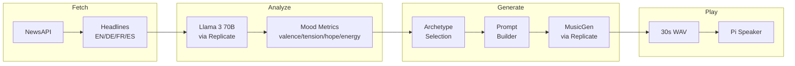

# World Theme Music Player

[](LICENSE)
[](https://www.raspberrypi.org/)
[](https://www.python.org/downloads/)

> **An AI-powered ambient music generator that transforms daily world news into mood-based soundscapes.**

 TBD

How does it look like?

 

Monitor Web dashboard

The system fetches news headlines from multiple regions, analyzes their emotional tone using an LLM, selects musical archetypes, and generates unique ambient music — all running autonomously on a Raspberry Pi.

---

## Table of Contents

- [How It Works](#how-it-works)
- [Prerequisites](#prerequisites)
- [Installation](#installation)
- [Hardware Testing](#hardware-testing)
- [Services Installation](#services-installation)
- [WiFi Manager](#wifi-manager)
- [Web Dashboard](#web-dashboard)
- [Configuration Reference](#configuration-reference)
- [Hardware Setup](#hardware-setup)
- [Project Structure](#project-structure)
- [License](#license)

---

## How It Works



### Pipeline Stages

| Stage | Module | Description |
|-------|--------|-------------|
| **1. Fetch** | `lib/news_fetcher.py` | Fetches headlines from NewsAPI in 4 languages |
| **2. Analyze** | `lib/llm_analyzer.py` | LLM extracts emotional dimensions: valence (-1 to +1), tension, hope, energy |
| **3. Select** | `lib/archetype_selector.py` | Rule-based scoring matches mood to 6 musical archetypes |
| **4. Build** | `lib/music_prompt_builder.py` | Constructs MusicGen prompt with structure + color + daily variety |
| **5. Generate** | `lib/music_generator.py` | Calls MusicGen stereo-melody-large via Replicate |
| **6. Process** | `lib/music_post_processor.py` | Applies fade-in/fade-out |
| **7. Play** | `lib/hardware_player.py` | GPIO buttons, LED feedback, radar motion detection |

---

## Prerequisites

### Hardware

> [!NOTE]
> Hardware details TBD — Custom HAT design documentation coming soon.

<!-- TODO: Add hardware list, circuit diagram, BOM -->

### API Accounts

You'll need accounts with these services:

| Service | Purpose | Cost |
|---------|---------|------|
| [NewsAPI](https://newsapi.org/account) | Fetch world news headlines | Free tier available |
| [Replicate](https://replicate.com/account) | Run LLM + MusicGen models | Pay-per-use (~$0.01/generation) |
| [Dropbox](https://www.dropbox.com/developers) | Backup generated music (optional) | Free |

> [COMMENT] More details about what to get from each and store for later ...

---

## Installation

### Step 1: Set Pi Date/Time

First, verify your Pi's date is correct:

```bash
date
```

If incorrect, fix via `raspi-config`:

```bash
sudo raspi-config
```

| Step | View |
|------|------|
| Select "Localisation Options" → ENTER |  |
| Select "Timezone" → ENTER |  |
| Select your region |  |

Tab to `<Finish>` and reboot:

```bash
sudo reboot
```
===================================================

### Step 2: Setup Project Deps

TBD - setup script stuff

===================================================

---

## Hardware Testing

Before installing services, test each component individually.

### Test GPIO Buttons & LEDs

```bash
uv run python tests/01_test_IOs.py
```

This tests:
- Play/Pause button (GPIO 22)
- Stop button (GPIO 27)
- Full Cycle button (GPIO 17)
- Player LED (GPIO 25)
- Radar LED (GPIO 23)

### Test Radar Detection

First, configure your radar model in `settings.json`:

```json
{
  "inputPins": {
    "radarModel": "RCWL-0516",
    "radarPin": 16,
    "radarEnablePin": 6
  }
}
```

| Setting | RCWL-0516 | RD-03D |
|---------|-----------|--------|
| Interface | GPIO | Serial (UART) |
| Detection | Presence | Movement (Doppler) |
| Range config | N/A | `radarMaxRangeMeters` |

Then test:

```bash
# For RCWL-0516 (GPIO-based)
uv run python tests/02_test_event_radar.py

# For RD-03D (Serial-based)
uv run python tests/02_test_serial_radar.py
```

#### Radar Behavior

> [COMMENT] Improve the below. Note fr all sections add meaningful descriptions like these . Ask if you are not sure 
Radars are used to detect presence and trigger audio playback loop for 5 mins (settings.json) ... 

| Setting | Default | Description |
|---------|---------|-------------|
| `motionTriggeredPlaybackDurationSec` | 300 | Auto-stop after 5 minutes |
| `cooldownAfterUserActionSec` | 60 | Ignore motion for 60s after user pause/stop |
| `radarMaxRangeMeters` | 2.5 | Detection range (RD-03D only) |

### Test Audio Output

```bash
# Play keep-alive tone
aplay keep_audio_ch_active.wav
```

### Test Full Pipeline

```bash
# Generate music (no playback)
uv run python main.py --fetch true --play false
```

Check `music_generated/` for the output WAV file.

### Test Hardware Player

```bash
# Interactive mode (keyboard controls)
uv run python run_player.py

Controls:
- `P` — Play/Pause
- `S` — Stop
- `Q` — Quit


# Daemon mode (GPIO only)
uv run python run_player.py --daemon
```
> [COMMENT] What they cna dio here and what to expect -- detail;s missing

---

## Services Installation

Once hardware testing passes, install the services:

### Check Current Status

```bash
./services/00_status.sh
```

### Install All Services

```bash
./services/01_install_and_start_services.sh
```

This installs:
- **music-player.service** — Plays generated music, handles GPIO buttons & radar
- **full-cycle-btn.service** — GPIO17 button triggers full news→music pipeline
- **process-monitor-web.service** — Web dashboard on port 7070
- **nginx** — Reverse proxy for port 80 access
- **Cron jobs** — Daily generation (3:00 AM) and backup (2:40 AM)

### Verify Installation

```bash
./services/00_status.sh
```

Expected output:
```
User Services

  ● full-cycle-btn.service
  ● music-player.service
  ● process-monitor-web.service

nginx

  ● nginx
  ● config installed

Cron Jobs

  ● generate (3:00 AM)
  ● backup (2:40 AM)
```

### Uninstall Services

```bash
./services/04_stop_and_uninstall_services.sh
```

### Useful Commands

```bash
# Check service status
systemctl --user status music-player.service

# View logs
journalctl --user -u music-player.service -f

# List cron jobs
crontab -l
```

---

## WiFi Manager

For headless WiFi configuration, install the [rpi-wifi-button](https://github.com/YOUR_USERNAME/rpi-wifi-button) project.

### Configuration for This Project

When installing rpi-wifi-button, use these settings:

| Setting | Value |
|---------|-------|
| Button GPIO | **26** (NET_RESET_BTN) |
| LED GPIO | **23** (shared with Radar LED) |

### States

<!-- TODO: Add screenshots/GIFs -->

| State | LED Behavior | Description |
|-------|--------------|-------------|
| Not Connected | <!-- GIF --> | Breathing LED |
| Reconnecting | <!-- GIF --> | Fast blink |
| Connected | <!-- GIF --> | Solid then off |

---

## Web Dashboard

A TUI-style web interface for monitoring the pipeline from any device on your network.


### Features

| Tab | Description |
|-----|-------------|
| **News** | Today's headlines grouped by region |
| **Pipeline** | Interactive visualization: news → archetypes → prompt |
| **Logs** | Live streaming logs (like `tail -f` in browser) |

### Access

| Method | URL |
|--------|-----|
| Via nginx | `http://aimusicplayer.local` |
| Direct | `http://aimusicplayer.local:7070` |

📖 **Full documentation:** [`web/README.md`](web/README.md)

---

## Configuration Reference

### `settings.json`

```json
{
  "inputPins": {
    "playPauseBtnPin": 22,
    "stopBtnPin": 27,
    "runFullCycleBtnPin": 17,
    "radarEnablePin": 6,
    "radarModel": "RCWL-0516",
    "radarPin": 16
  },
  "outputPins": {
    "playerStateLEDPin": 25,
    "radarStateLEDPin": 23
  },
  "hwFeatures": {
    "btnDebounceTimeMs": 0.05,
    "maxLEDBrightness": 25,
    "pauseBreathingFreq": 0.25,
    "motionTriggeredPlaybackDurationSec": 300,
    "cooldownAfterUserActionSec": 60
  },
  "music": {
    "fadeInDurationSec": 1.5,
    "fadeOutDurationSec": 2.0
  },
  "backup": {
    "generation_results_to_dropbox": false
  }
}
```

### `news_config.json`

```json
{
  "regions": {
    "English_Speaking": { "language": "en" },
    "German_Speaking": { "language": "de" },
    "French_Speaking": { "language": "fr" },
    "Spanish_Speaking": { "language": "es" }
  }
}
```

---

## Hardware Setup

### Shutdown & Wake Button (GPIO3)

Enable hardware shutdown/wake using GPIO3 button.

#### Step 1: Disable I2C

> [!WARNING]
> GPIO3 is shared with I2C SCL. You must disable I2C to use it for shutdown.

```bash
sudo raspi-config
```

| Step | View |
|------|------|
| Select *Interface Options* |  |
| Select *I2C* |  |
| Select *No* to disable |  |
| *Finish* and reboot |  |

#### Step 2: Enable gpio-shutdown Overlay

```bash
sudo nano /boot/firmware/config.txt
```

Add after the overlays comment section:

```ini
dtoverlay=gpio-shutdown
```

Reboot and test:
- Press GPIO3 button → Pi shuts down
- Press again → Pi wakes up

---

## Project Structure

```txt
├── README.md
├── PI-POSTBOOT-SETUP.md
├── LICENSE
├── assets/
├── lib/
│   ├── hardware_player.py
│   ├── radar_controller.py
│   ├── __init__.py
│   ├── llm_analyzer.py
│   ├── music_generator.py
│   ├── music_post_processor.py
│   ├── news_fetcher.py
│   ├── player.py
│   └── settings.py
├── llm_agents/
│   ├── __init__.py
│   ├── musicgen_prompt_crafter.py
│   ├── news_analyzer.py
├── logs/
│   ├── cron.log
│   ├── full_cycle_btn.log
│   ├── player_service.log
│   └── world_theme_music_player.log
├── music_generated/
│   └── generated_music_will_go_here
├── prompts/
│   ├── musicgen_prompt_crafter_system.md
│   └── news_analyzer_system.md
├── pyproject.toml
├── uv.lock
├── news_config.json
├── settings.json
├── main.py
├── run_full_cycle_btn.py
├── run_player.py
├── keep_audio_ch_active.wav
├── services/
│   ├── full-cycle-btn.service
│   └── music-player.service
├── tests/
│   ├── 01_test_IOs.py
│   ├── 02_test_event_radar.py
│   ├── 02_test_serial_radar.py
│   └── 03_test_serial_radar_as_event.py
└── tools/
    └── bkp_gen_music.py
```

---

## License

[Unlicense](LICENSE)

---

### Step 2: Clone & Install Dependencies

```bash
# Clone the repository
git clone https://github.com/YOUR_USERNAME/current_state.git
cd current_state

# Install Python dependencies
uv sync
```

> [!TIP]
> If `uv` is not installed, see [Manual Setup Instructions](#manual-setup-instructions) at the bottom.

### Step 3: Configure Environment Variables

```bash
cp .env.template .env
nano .env
```

Edit the following values:

#### `NEWS_API_KEY`

1. Create account: https://newsapi.org/account
2. Generate API key
3. Paste into `.env`:
   ```
   NEWS_API_KEY="your_key_here"
   ```

#### `REPLICATE_API_TOKEN`

1. Create account: https://replicate.com/account
2. Set up billing: https://replicate.com/account/billing
   > Cost is minimal (~$0.01 per generation, runs once daily)
3. Generate token: https://replicate.com/account/api-tokens
4. Paste into `.env`:
   ```
   REPLICATE_API_TOKEN="your_token_here"
   ```

#### Dropbox Backup (Optional)

If you want automatic cloud backup of generated music:

```
DROPBOX_CLIENT_ID="your_client_id"
DROPBOX_CLIENT_SECRET="your_client_secret"
DROPBOX_REFRESH_TOKEN="your_refresh_token"
```

Also enable in `settings.json`:
```json
{
  "backup": {
    "generation_results_to_dropbox": true
  }
}
```

---

## Manual Setup Instructions

<details>
<summary><strong>Click to expand</strong> — For reference when creating setup.sh</summary>

### Install System Dependencies

```bash
sudo apt update -y
sudo apt upgrade -y 
sudo apt install git -y 
sudo apt install build-essential libssl-dev zlib1g-dev libbz2-dev libreadline-dev libsqlite3-dev curl libncursesw5-dev xz-utils tk-dev libxml2-dev libxmlsec1-dev libffi-dev liblzma-dev jq tree -y
sudo apt install python3-dev -y
```

### Install Audio Dependencies

```bash
sudo apt-get install libportaudio2 -y
```

### Install UV

```bash
curl -LsSf https://astral.sh/uv/install.sh | sh
```

### GPIO Permissions

```bash
sudo usermod -a -G gpio $USER
sudo reboot
```

### Project Setup

```bash
git clone https://github.com/YOUR_USERNAME/current_state.git
cd current_state
uv sync
```

If RPi.GPIO fails:
```bash
uv pip install RPi.GPIO --break-system-packages
```

### Manual Service Installation (Legacy)

If not using the install script:

```bash
# Music Player
cp services/music-player.service ~/.config/systemd/user/
systemctl --user daemon-reload
systemctl --user enable music-player.service
systemctl --user start music-player.service

# Full Cycle Button
cp services/full-cycle-btn.service ~/.config/systemd/user/
systemctl --user daemon-reload
systemctl --user enable full-cycle-btn.service
systemctl --user start full-cycle-btn.service

# Enable linger
sudo loginctl enable-linger pi
```

### Manual Cron Setup (Legacy)

```bash
crontab -e

# Add:
40 2 * * * cd /home/pi/current_state && /home/pi/.local/bin/uv run python tools/bkp_gen_music.py >> /home/pi/current_state/logs/backup.log 2>&1
0 3 * * * cd /home/pi/current_state && /home/pi/.local/bin/uv run python main.py --fetch true --play false >> /home/pi/current_state/logs/cron.log 2>&1
```

</details>

---

## TODO

- WIP: Main README Docu ... 🟠
- Canvas to show in tablet landscape mode ...
- Serial Radar detection algo improve (beam and enter and exit based)
- Setup scripts:
  - Main dep install scripts
- Other region of news

- Hardware Update Steps: 
  - Speaker Switch switcher 
  - Update circuit 
    - Also add an extra (3D) side Fan for PI
  - Place new order for SLA prints 
  - Print PLA locally 
  - Assemble new one ... 

**Future**:
- More archetypes
- Embedding models if needed
- Data viz after a period of time on the world sentiment shifts

