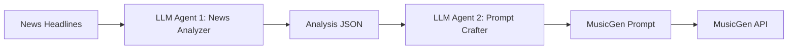
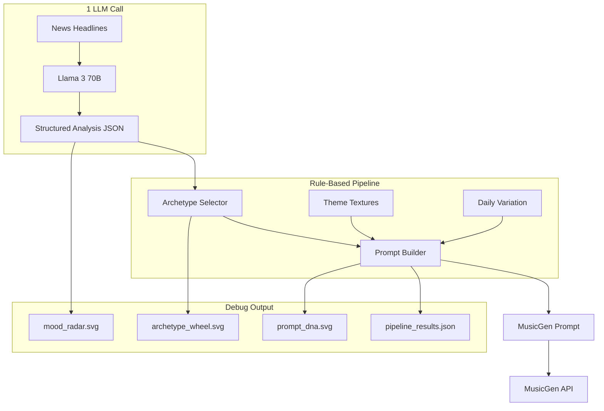
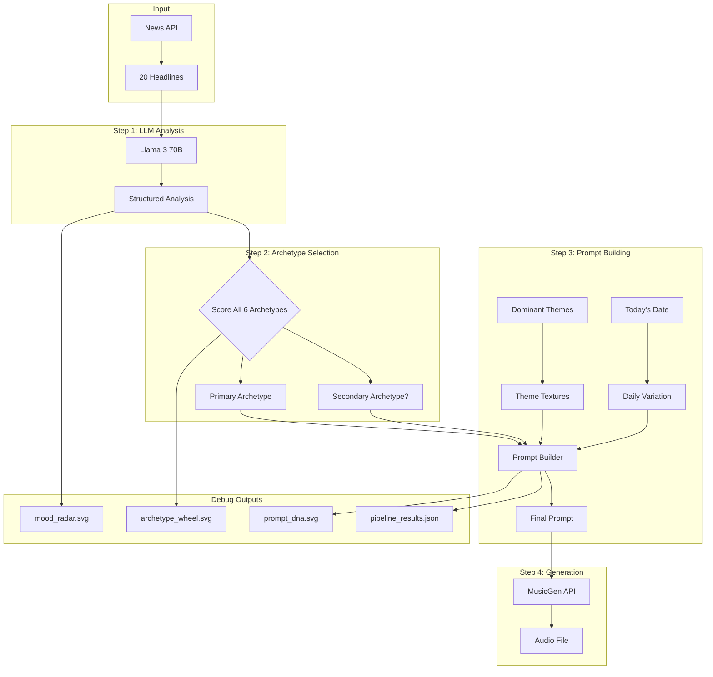
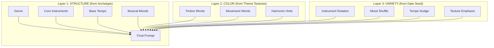

# Music Prompt Generation Pipeline

## Overview

The **World Theme Music Player** generates ambient music that reflects the mood of daily world news. This document explains the complete pipeline from news headlines to MusicGen prompts, the architectural decisions, and why this approach was chosen.

---

## Table of Contents

1. [MusicGen: The Foundation](#musicgen-the-foundation)
2. [Problem Statement](#problem-statement)
3. [Architecture Evolution](#architecture-evolution)
4. [Pipeline Overview](#pipeline-overview)
5. [Detailed Component Breakdown](#detailed-component-breakdown)
6. [The Three-Layer Prompt Architecture](#the-three-layer-prompt-architecture)
7. [Archetype System](#archetype-system)
8. [Theme Textures](#theme-textures)
9. [Daily Variation System](#daily-variation-system)
10. [Visualizations](#visualizations)
11. [File Structure](#file-structure)
12. [Running the Pipeline](#running-the-pipeline)
13. [Sample Output](#sample-output)

---

## MusicGen: The Foundation

This entire pipeline architecture is designed around the capabilities and constraints of **Meta's MusicGen** model. Understanding MusicGen's behavior is essential to understanding why we made the design choices we did.

### What is MusicGen?

MusicGen is Meta's open-source text-to-music generation model, released as part of the [AudioCraft](https://github.com/facebookresearch/audiocraft) library. Given a text prompt, it generates coherent music audio.

**Key characteristics:**
- Generates 30-second audio clips
- Understands musical terminology (genres, instruments, moods, tempo)
- Works via Replicate API in our implementation
- Model: `meta/musicgen` (we use the stereo variant)

### MusicGen Prompt Research Findings

Through extensive testing, we discovered what makes MusicGen prompts effective:

| What Works Well | What Doesn't Work |
|-----------------|-------------------|
| Adjective + instrument ("soft piano", "ethereal pads") | Abstract concepts ("the feeling of rain") |
| Explicit BPM ("slow 65 BPM") | Vague tempo ("not too fast") |
| Musical mood words ("flowing", "atmospheric") | Story/narrative descriptions |
| Genre labels ("ambient electronic") | Overly complex genre mixes |
| Comma-separated keywords | Long prose sentences |
| Technical terms ("stereo", "reverb") | Production jargon ("side-chain compression") |

### Key Insight: Curated Vocabulary

MusicGen has a "vocabulary" of terms it responds to reliably. Random LLM-generated text often includes words MusicGen ignores or misinterprets.

**Example - LLM might generate:**
```
"Create a soundscape that evokes the uncertainty of global markets 
while maintaining an underlying sense of hope for diplomatic resolution"
```

**MusicGen understands better:**
```
"ambient electronic, soft synths, gentle bells, atmospheric, 
hopeful, restrained, slow 70 BPM, stereo"
```

### Why This Shaped Our Architecture

1. **Curated archetypes** - Each archetype contains only MusicGen-tested vocabulary
2. **Rule-based prompt building** - No LLM generating prompt text directly
3. **Structured keywords** - Comma-separated, adjective+noun patterns
4. **Explicit tempo** - Always include BPM for consistency
5. **Limited complexity** - Keep prompts focused, not overloaded

The entire pipeline exists to translate *news mood* into *MusicGen-compatible vocabulary* reliably.

---

## Problem Statement

**Goal:** Generate ambient, bathroom-appropriate music that emotionally reflects the day's world news.

**Constraints:**
- Music must always be calm/ambient (never aggressive or jarring)
- Different news moods (positive vs negative) should produce noticeably different music
- Prompts must work reliably with Meta's MusicGen model
- System should produce varied output day-to-day (not repetitive)
- Pipeline should be debuggable and testable

---

## Architecture Evolution

### Previous Approach: Two-Agent LLM System



**Problems with this approach:**
1. **Two LLM calls** = 2x latency, 2x cost, 2x failure points
2. **Non-deterministic** - Same analysis could yield different prompts
3. **Black box** - Hard to debug why a particular prompt was generated
4. **Inconsistent quality** - LLM might generate prompts with vocabulary MusicGen doesn't understand
5. **No testability** - Can't unit test LLM output

### New Approach: Single LLM + Rule-Based Pipeline



**Benefits:**
1. **Single LLM call** - Only the analysis step uses LLM
2. **Deterministic selection** - Same analysis always yields same archetype
3. **Curated vocabulary** - All prompt words are pre-tested with MusicGen
4. **Fully testable** - Archetype selection and prompt building are pure functions
5. **Debuggable** - Visual outputs show exactly why each decision was made
6. **Daily variation** - Date-seeded randomness for freshness without chaos

---

## Pipeline Overview



---

## Detailed Component Breakdown

### Step 1: LLM Analysis

**File:** [`lib/llm_analyzer.py`](../lib/llm_analyzer.py)

**Input:** List of news article dictionaries with `title` and `source` fields

**Output:** Structured JSON with exactly these fields:

```json
{
    "emotional_valence": 0.3,      // -1 (very negative) to +1 (very positive)
    "tension_level": 0.5,          // 0 (calm) to 1 (high tension)
    "hope_factor": 0.6,            // 0 (hopeless) to 1 (very hopeful)
    "energy_level": "medium",      // "low", "medium", or "high"
    "dominant_themes": ["economy", "politics", "science"],  // Up to 5
    "summary": "A mixed day with economic concerns..."      // One sentence
}
```

**Why these dimensions?**

| Dimension | Purpose | Maps To |
|-----------|---------|---------|
| `emotional_valence` | Overall positivity/negativity | Major/minor tonality, bright/dark instruments |
| `tension_level` | Conflict/uncertainty | Tempo variation, harmonic complexity |
| `hope_factor` | Forward-looking optimism | Melodic movement, resolution |
| `energy_level` | Intensity/urgency | Tempo, dynamics |
| `dominant_themes` | Subject matter | Timbral textures (see Theme Textures) |

**LLM Configuration:**
- Model: `meta/meta-llama-3-70b-instruct`
- Temperature: `0.3` (low for consistent structured output)
- Max tokens: `500`
- Format: Llama 3 chat template with system prompt

### Step 2: Archetype Selection

**File:** [`lib/archetype_selector.py`](../lib/archetype_selector.py)

**Input:** `NewsAnalysis` dataclass

**Output:** `ArchetypeSelection` with primary, optional secondary, scores, and intensity level

#### The Six Archetypes

Each archetype represents a "mood zone" that maps to specific MusicGen vocabulary:

| Archetype | Valence | Tension | Hope | Genre | Character |
|-----------|---------|---------|------|-------|-----------|
| **Tranquil Optimism** | High (+0.6) | Low (0.2) | High (0.8) | Ambient Electronic | Peaceful, bright, flowing |
| **Reflective Calm** | Neutral (+0.2) | Low (0.2) | Medium (0.5) | Ambient New Age | Contemplative, spacious |
| **Gentle Tension** | Slight negative (-0.1) | High (0.6) | Medium (0.4) | Cinematic Ambient | Atmospheric, layered |
| **Melancholic Beauty** | Negative (-0.4) | Medium (0.5) | Low (0.3) | Ambient Orchestral | Emotional, wistful |
| **Cautious Hope** | Slight positive (+0.2) | Medium (0.5) | High (0.6) | Ambient Electronic | Building, anticipating |
| **Serene Resilience** | Positive (+0.3) | Medium (0.4) | High (0.7) | Ambient Post-Rock | Expansive, determined |

#### Scoring Algorithm

For each archetype, calculate match score across all dimensions:

```python
def calculate_dimension_match(value, center, tolerance):
    distance = abs(value - center)
    normalized = distance / tolerance
    score = exp(-normalized ** 2)  # Gaussian falloff
    return score

# Weighted combination
weights = {
    "valence": 0.30,   # Most important for mood
    "tension": 0.25,
    "hope": 0.30,      # Most important for mood
    "energy": 0.15
}
```

#### Secondary Archetype Selection (Smart Blending)

A secondary archetype is selected if:
1. It's **compatible** with primary (per compatibility matrix)
2. Its score ≥ 70% of primary score
3. Its absolute score ≥ 0.50

**Compatibility Matrix:**

```
tranquil_optimism  → [cautious_hope, reflective_calm, serene_resilience]
reflective_calm    → [cautious_hope, serene_resilience, melancholic_beauty]
gentle_tension     → [melancholic_beauty, cautious_hope, reflective_calm]
melancholic_beauty → [gentle_tension, reflective_calm]
cautious_hope      → [tranquil_optimism, gentle_tension, serene_resilience]
serene_resilience  → [cautious_hope, reflective_calm, tranquil_optimism]
```

### Step 3: Prompt Building

**File:** [`lib/music_prompt_builder.py`](../lib/music_prompt_builder.py)

**Input:** Archetype selection, dominant themes, today's date

**Output:** Three prompt variants + full component breakdown

---

## The Three-Layer Prompt Architecture



### Layer 1: Structure (from Archetype)

Provides the foundation - genre, instruments, moods, tempo:

```python
# Example: Cautious Hope archetype
MusicDescriptor(
    genre="ambient electronic",
    instruments=["soft synths", "gentle bells", "flowing textures", "light arpeggios"],
    mood_musical=["building", "delicate", "atmospheric", "subtle"],
    mood_emotional=["hopeful", "restrained", "peaceful", "anticipating"],
    tempo_bpm="slow 70 BPM",
    tempo_value=70,
    technical=["stereo", "clean", "bright"]
)
```

### Layer 2: Color (from Theme Textures)

Adds timbral character based on news themes:

```python
# Example: Technology theme
ThemeTexture(
    timbre=["digital", "crystalline", "precise", "clean", "synthetic"],
    movement=["pulsing", "sequenced", "algorithmic", "gridded"],
    harmonic=["electronic", "processed", "pure tones"]
)

# Example: Conflict theme
ThemeTexture(
    timbre=["shadowed", "distant", "veiled", "muted", "heavy"],
    movement=["unsettled", "shifting", "restless", "turbulent"],
    harmonic=["minor undertones", "dissonant hints", "unresolved", "tense"]
)
```

### Layer 3: Variety (from Date Seed)

Ensures day-to-day variation while remaining deterministic:

```python
@dataclass
class DailyVariation:
    instrument_rotation: int      # 0-2: which instrument variant to prefer
    mood_shuffle_seed: int        # Seed for mood word ordering
    texture_emphasis: str         # "timbre", "movement", or "harmonic"
    tempo_nudge: int              # -2 to +3 BPM adjustment
    
    @classmethod
    def from_date(cls, d: date):
        seed = int(md5(d.isoformat().encode()).hexdigest()[:8], 16)
        rng = Random(seed)
        return cls(
            instrument_rotation=rng.randint(0, 2),
            mood_shuffle_seed=seed,
            texture_emphasis=rng.choice(["timbre", "movement", "harmonic"]),
            tempo_nudge=rng.randint(-2, 3)
        )
```

### Three Prompt Styles

The builder outputs three variations of the same content:

**1. Default (Balanced):**
```
Ambient electronic, with soft synths and gentle bells, building and hopeful, 
calm, moderate 72 BPM, stereo, spacious
```

**2. Minimal (Keywords only):**
```
ambient electronic, soft synths, building, digital, 72 BPM, stereo
```

**3. Natural (Conversational):**
```
A building and hopeful piece of ambient electronic music with digital textures 
featuring soft synths and gentle bells, at a moderate 72 BPM tempo
```

---

## Archetype System

### Why Archetypes?

Instead of letting an LLM freely generate prompt text (unpredictable), we define a fixed set of "mood zones" with curated MusicGen vocabulary.

**Key insight:** MusicGen responds best to specific word combinations. Through testing, we identified vocabulary that reliably produces desired sounds.

### Archetype Definitions

**File:** [`lib/archetypes.py`](../lib/archetypes.py)

```python
ARCHETYPES = {
    ArchetypeName.TRANQUIL_OPTIMISM: MusicDescriptor(
        genre="ambient electronic",
        instruments=["soft synth pads", "gentle piano", "subtle chimes", "light bells"],
        mood_musical=["flowing", "light", "melodic", "airy"],
        mood_emotional=["peaceful", "hopeful", "serene", "uplifting"],
        tempo_bpm="slow 65 BPM",
        tempo_value=65,
        technical=["stereo", "warm", "clean"]
    ),
    
    ArchetypeName.MELANCHOLIC_BEAUTY: MusicDescriptor(
        genre="ambient orchestral",
        instruments=["expressive strings", "warm piano", "ethereal pads", "soft cello"],
        mood_musical=["flowing", "swelling", "tender", "emotional"],
        mood_emotional=["melancholic", "nostalgic", "beautiful", "wistful"],
        tempo_bpm="slow 62 BPM",
        tempo_value=62,
        technical=["stereo", "cinematic", "warm"]
    ),
    # ... 4 more archetypes
}
```

### Intensity Modifiers

Based on `tension_level`, adjectives are adjusted:

| Intensity | Tension Range | Adjectives | Tempo Adjust |
|-----------|---------------|------------|--------------|
| Low | < 0.3 | soft, gentle, subtle, delicate | -3 BPM |
| Medium | 0.3 - 0.6 | warm, flowing, smooth, balanced | 0 BPM |
| High | ≥ 0.6 | deep, rich, layered, evolving | +3 BPM |

---

## Theme Textures

### Why Theme Textures?

News themes (technology, conflict, environment) should influence the *character* of music, not just its mood.

**File:** [`lib/theme_textures.py`](../lib/theme_textures.py)

### Texture Dimensions

Each theme maps to three texture dimensions:

| Dimension | Purpose | Example (Technology) |
|-----------|---------|---------------------|
| **Timbre** | Sound quality | digital, crystalline, precise |
| **Movement** | Flow/rhythm | pulsing, sequenced, algorithmic |
| **Harmonic** | Tonal color | electronic, processed |

### Theme Library (30+ themes)

```python
THEME_TEXTURES = {
    "conflict": ThemeTexture(
        timbre=["shadowed", "distant", "veiled", "muted"],
        movement=["unsettled", "shifting", "restless"],
        harmonic=["minor undertones", "dissonant hints", "tense"]
    ),
    "peace": ThemeTexture(
        timbre=["open", "sunlit", "clear", "radiant"],
        movement=["breathing", "gentle swells", "expansive"],
        harmonic=["major", "resolved", "consonant", "bright"]
    ),
    "technology": ThemeTexture(
        timbre=["digital", "crystalline", "precise", "synthetic"],
        movement=["pulsing", "sequenced", "algorithmic"],
        harmonic=["electronic", "processed", "pure tones"]
    ),
    # ... 27+ more themes
}
```

### Theme Aliases

Common variations map to canonical themes:

```python
THEME_ALIASES = {
    "military": "conflict",
    "warfare": "war",
    "diplomacy": "peace",
    "tech": "technology",
    "AI": "technology",
    "earthquake": "disaster",
    # ... many more
}
```

### Texture Blending

When multiple themes are present, textures are blended:

```python
def blend_textures(themes: List[str], date_seed: date) -> TextureBlend:
    # Collect all texture words from all themes
    # Shuffle deterministically using date seed
    # Return top N words from each category
```

---

## Daily Variation System

### The Problem

Without variation, the same news mood would always produce identical prompts. Users would hear very similar music day after day.

### The Solution: Date-Seeded Randomness

```python
def from_date(d: date) -> DailyVariation:
    # Create deterministic seed from date
    seed = int(md5(d.isoformat().encode()).hexdigest()[:8], 16)
    rng = Random(seed)
    
    return DailyVariation(
        instrument_rotation=rng.randint(0, 2),    # Rotate instrument priority
        mood_shuffle_seed=seed,                    # Shuffle mood word order
        texture_emphasis=rng.choice([...]),        # Emphasize timbre/movement/harmonic
        tempo_nudge=rng.randint(-2, 3)            # Small BPM variation
    )
```

### What Gets Varied

| Parameter | Effect | Range |
|-----------|--------|-------|
| `instrument_rotation` | Which instrument comes first in prompt | 0-2 |
| `mood_shuffle_seed` | Order of mood words | Deterministic shuffle |
| `texture_emphasis` | Which texture dimension gets extra weight | timbre/movement/harmonic |
| `tempo_nudge` | Small tempo adjustment | -2 to +3 BPM |

### Determinism

Same date always produces same variation. This means:
- Debugging is possible (reproduce exact conditions)
- Multiple runs on same day produce same output
- Testing can use fixed dates

---

## Visualizations

### Why Visualizations?

Debugging a multi-step pipeline requires understanding what happened at each step. SVG outputs provide immediate visual feedback.

**File:** [`lib/visualizations.py`](../lib/visualizations.py)

### Three Visualizations

#### 1. Mood Radar (`mood_radar.svg`)

4-axis radar chart showing the LLM analysis dimensions:
- Hope (top)
- Tension (right)
- Valence (bottom)
- Energy (left)

```
        Hope
          |
          |
  Energy--+--Tension
          |
          |
       Valence
```

#### 2. Archetype Wheel (`archetype_wheel.svg`)

Circular visualization showing all 6 archetypes with:
- Score represented by segment size
- Primary highlighted in bold
- Secondary highlighted (if selected)
- Compatibility indicators

#### 3. Prompt DNA (`prompt_dna.svg`)

Three-column breakdown showing:
- **STRUCTURE**: Archetype, genre, tempo, intensity
- **COLOR**: Themes, moods, textures
- **OUTPUT**: Final instruments, characteristics, prompt preview

---

## File Structure

### Test Files (Development)

Located in [`tests/music_gen_study/`](../tests/music_gen_study/)

```
tests/music_gen_study/
├── 01_news_analyzer.py      # Standalone LLM analysis testing
├── 02_archetype_selector.py # Standalone selection testing
├── 03_prompt_builder.py     # Standalone prompt building testing
├── 04_generate_music.py     # MusicGen API testing
├── 05_full_pipeline.py      # End-to-end pipeline testing
├── archetypes.py            # Archetype definitions (copied to lib/)
├── theme_textures.py        # Theme textures (copied to lib/)
├── visualizations.py        # SVG generation (copied to lib/)
├── test_data/
│   ├── news_positive.json   # Test scenario: good news day
│   ├── news_negative.json   # Test scenario: bad news day
│   ├── news_mixed.json      # Test scenario: typical day
│   └── news_edge_cases.json # Test scenario: edge cases
└── outputs/
    ├── run_positive/        # Output from positive scenario
    ├── run_negative/        # Output from negative scenario
    ├── run_mixed/           # Output from mixed scenario
    └── run_real/            # Output from real news test
```

### Production Files

Located in [`lib/`](../lib/)

```
lib/
├── llm_analyzer.py          # Pipeline orchestrator (main entry point)
├── archetypes.py            # 6 archetype definitions
├── archetype_selector.py    # Rule-based scoring
├── music_prompt_builder.py  # 3-layer prompt construction
├── theme_textures.py        # 30+ theme-to-texture mappings
├── visualizations.py        # SVG generation
├── news_fetcher.py          # News API client
├── music_generator.py       # MusicGen API client
├── music_post_processor.py  # Audio fade effects
├── player.py                # Audio playback
├── hardware_player.py       # Raspberry Pi hardware
└── settings.py              # Configuration
```

### Output Files

```
generation_results/
├── pipeline_results.json    # Full pipeline output (overwritten daily)
├── prompt.txt               # Final prompt text
└── visualizations/
    ├── mood_radar.svg       # Analysis visualization
    ├── archetype_wheel.svg  # Selection visualization
    └── prompt_dna.svg       # Prompt composition visualization

music_generated/
└── world_theme_YYYY-MM-DD_HH-MM-SS.wav  # Generated audio files
```

---

## Running the Pipeline

### Full Pipeline (Production)

```bash
# Fetch news and generate music
uv run python main.py --fetch true --play true

# Use cached news (if exists for today)
uv run python main.py --play true

# Generate without playing
uv run python main.py --fetch true --play false

# Use local news file
uv run python main.py --local-file news_data_2026-01-08.json --play false
```

### Test Individual Steps

```bash
cd tests/music_gen_study/

# Test LLM analysis only
python 01_news_analyzer.py --scenario positive
python 01_news_analyzer.py --scenario negative --dry-run

# Test archetype selection only
python 02_archetype_selector.py --analysis outputs/analysis_positive.json

# Test prompt building only
python 03_prompt_builder.py --selection outputs/selection_positive.json --themes technology conflict

# Test music generation only
python 04_generate_music.py --prompt "ambient electronic, soft synths, peaceful, 70 BPM"

# Run full test pipeline
python 05_full_pipeline.py --scenario positive --generate-audio
python 05_full_pipeline.py --scenario negative --generate-audio
```

---

## Sample Output

### Input: Mixed News Day (Real Data)

20 headlines from global news sources covering economy, politics, technology, entertainment.

### LLM Analysis Output

```json
{
    "emotional_valence": 0.1,
    "tension_level": 0.4,
    "hope_factor": 0.5,
    "energy_level": "medium",
    "dominant_themes": ["economy", "politics", "technology", "entertainment", "business"],
    "summary": "A day of mixed news with economic and political tensions balanced by technological advancements."
}
```

### Archetype Selection

| Archetype | Score | Components (V/T/H/E) |
|-----------|-------|---------------------|
| **cautious_hope** | 0.924 | 0.94 / 0.90 / 0.90 / 1.00 |
| reflective_calm | 0.892 | 0.94 / 0.64 / 1.00 / 1.00 |
| **serene_resilience** | 0.826 | 0.78 / 1.00 / 0.64 / 1.00 |
| gentle_tension | 0.812 | 0.78 / 0.64 / 0.90 / 1.00 |
| melancholic_beauty | 0.629 | 0.21 / 0.90 / 0.64 / 1.00 |
| tranquil_optimism | 0.484 | 0.21 / 0.64 / 0.37 / 1.00 |

**Selected:** Primary = cautious_hope, Secondary = serene_resilience (blend: 53%/47%)

### Final Prompt

**Default:**
```
Ambient electronic, with smooth swelling strings, soft synths and gentle bells, 
building and hopeful, calm, moderate 72 BPM, stereo, spacious
```

**Minimal:**
```
ambient electronic, smooth swelling strings, building, fun, 72 BPM, stereo
```

**Natural:**
```
A building and hopeful piece of ambient electronic music with fun textures 
featuring smooth swelling strings and soft synths, at a moderate 72 BPM tempo
```

### Generated Audio

- **File:** `music_generated/world_theme_2026-01-08_22-36-18.wav`
- **Duration:** ~30 seconds
- **Character:** Calm, slightly hopeful ambient electronic with soft synths

---

## Design Decisions Summary

| Decision | Rationale |
|----------|-----------|
| Single LLM call | Reduces latency, cost, and failure points |
| Rule-based selection | Deterministic, testable, debuggable |
| Six archetypes | Covers full mood spectrum while staying ambient |
| Curated vocabulary | Only words tested to work with MusicGen |
| Theme textures | Adds subject-matter character without changing mood |
| Date-seeded variation | Fresh output without unpredictability |
| SVG visualizations | Instant visual debugging |
| Three prompt styles | Different MusicGen response characteristics |

---

## References

- [MusicGen by Meta](https://github.com/facebookresearch/audiocraft)
- [Replicate API](https://replicate.com/meta/musicgen)
- [Llama 3 by Meta](https://replicate.com/meta/meta-llama-3-70b-instruct)
