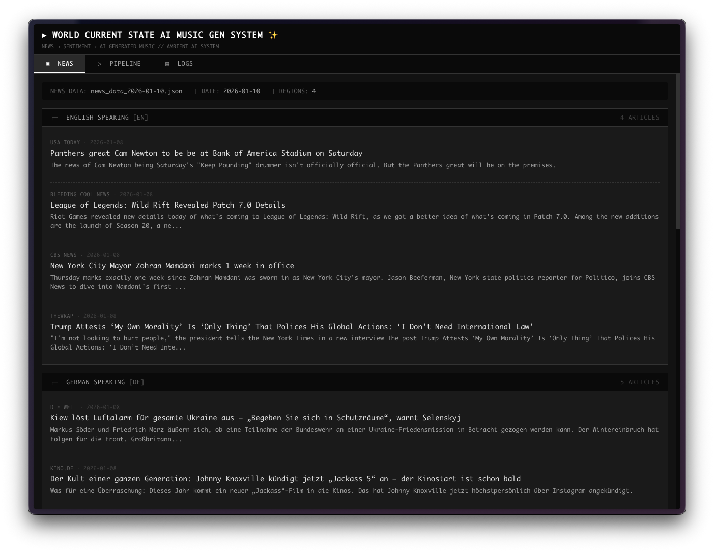
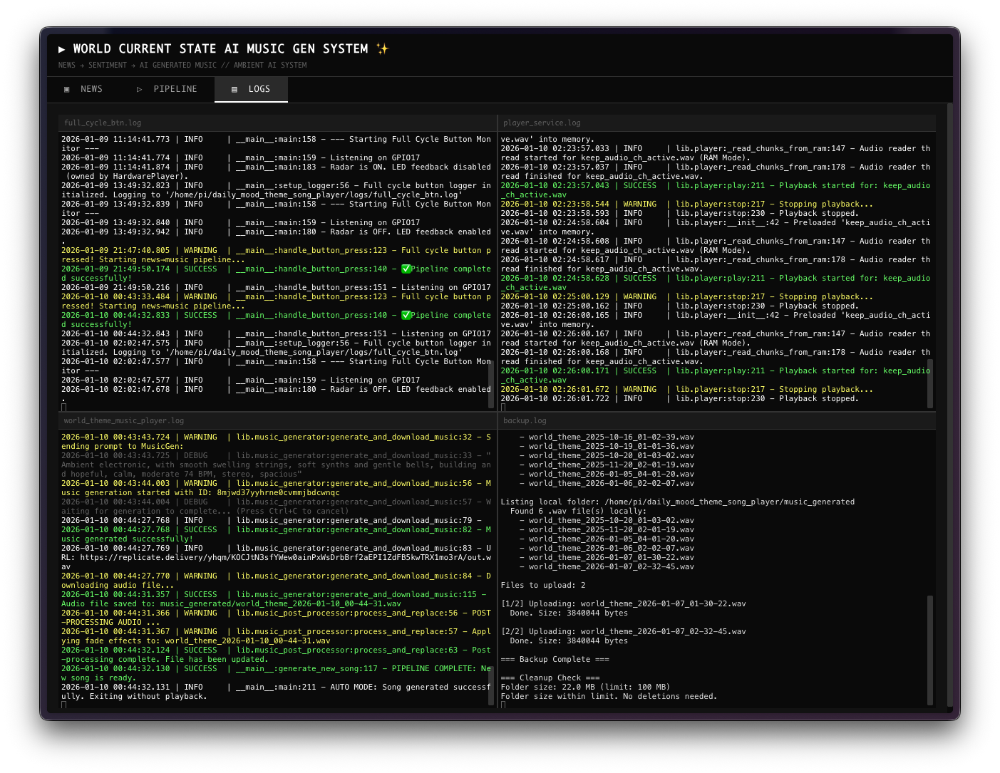

# Web Dashboard

TUI-style web interface for monitoring the World Theme Music Player pipeline.





---

## What Is This?

The web dashboard provides a **real-time window** into the music generation pipeline. Instead of SSHing into your Pi and tailing log files, you can open a browser on your phone or laptop and see:

- **What news was fetched today** — headlines grouped by region
- **How the pipeline processed it** — interactive visualization of news → archetypes → prompt → music
- **Live system logs** — streaming terminal output in your browser

It's designed to look like a retro TUI (text user interface) with a Dracula color theme — because why not make monitoring beautiful?

---

## How It Works

### Data Flow Overview

```
┌─────────────────────────────────────────────────────────────────────────┐
│                         RASPBERRY PI                                    │
│                                                                         │
│  ┌──────────────┐     ┌──────────────┐     ┌──────────────────────────┐ │
│  │  main.py     │────►│ JSON files   │────►│  web/app.py (FastAPI)    │ │
│  │  (3am cron)  │     │              │     │                          │ │
│  └──────────────┘     │ • news_data_ │     │  Reads files on request  │ │
│                       │   YYYY-MM-DD │     │  Serves via HTTP/WS      │ │
│                       │   .json      │     │                          │ │
│                       │              │     └────────────┬─────────────┘ │
│                       │ • pipeline_  │                  │               │
│                       │   results.   │                  │ Port 7070     │
│                       │   json       │                  │               │
│                       │              │                  ▼               │
│                       │ • logs/      │     ┌──────────────────────────┐ │
│                       │   *.log      │     │  nginx (optional)        │ │
│                       └──────────────┘     │  Port 80 → 7070          │ │
│                                            └────────────┬─────────────┘ │
└─────────────────────────────────────────────────────────┼───────────────┘
                                                          │
                                                          ▼
                                              ┌──────────────────────┐
                                              │  Your Browser        │
                                              │  (phone/laptop)      │
                                              │                      │
                                              │  aimusicplayer.local │
                                              └──────────────────────┘
```

### Files the Dashboard Reads

| File | Location | Generated By | Contains |
|------|----------|--------------|----------|
| `news_data_YYYY-MM-DD.json` | Project root | `main.py --fetch true` | Raw news headlines from all regions |
| `pipeline_results.json` | `generation_results/` | `main.py` | Full pipeline output: analysis, archetypes, prompt components |
| `*.log` | `logs/` | Various services | System logs (streamed live) |

**The dashboard never writes to these files** — it only reads them. The main pipeline (`main.py`) generates them during the daily 3am cron job.

---

## The Three Tabs

### Tab 1: News Bulletin

**What it shows:** Today's fetched news headlines, grouped by region (English, German, French, Spanish).

**How it works:**

1. Browser requests `/news` (page load)
2. `app.py` calls `get_news_context()` to find today's `news_data_YYYY-MM-DD.json` file
3. Returns rendered HTML with headlines grouped by region via Jinja2 template

**File:** `web/routes/news.py`

```python
# Loads news data and returns context for template
def get_news_context() -> dict:
    return load_news_data()
```

### Tab 2: Pipeline Visualization

**What it shows:** Interactive graph showing how news sentiment flows through the pipeline to become a music prompt.

**How it works:**

1. Browser requests `/api/derivation`
2. `app.py` reads `generation_results/pipeline_results.json`
3. Returns structured JSON with:
   - News analysis metrics (valence, tension, hope, energy)
   - Archetype scores and selection
   - Theme textures
   - Final prompt components
4. `derivation.js` builds a vis-network graph

**The visualization shows:**

```
NEWS SCRAPING → STRUCTURED OUTPUT → METRICS → ARCHETYPES → LAYERS → FINAL PROMPT
     │                │                           │           │
     │                └── THEMES ─────────────────┘           │
     │                                                        │
     └── DATE SEED ───────────────────────────────────────────┘
```

**File:** `web/static/js/derivation.js`

```javascript
// Creates vis-network nodes and edges from pipeline data
function buildVisualization(data) {
    const nodes = [];
    const edges = [];
    
    // News scraping node (cyan)
    nodes.push(createNode('news_scraping', ...));
    
    // Structured output with metrics (purple)
    nodes.push(createNode('structured_output', ...));
    
    // Each archetype as a node (pink/orange based on score)
    data.archetypes.forEach(arch => {
        nodes.push(createNode(`arch_${arch.name}`, ...));
    });
    
    // ... layers, final prompt, edges connecting them
}
```

**Interactivity:**
- Hover over nodes to see detailed tooltips
- Drag nodes to rearrange
- Pan and zoom the canvas
- "Reset Layout" button restores original positions

### Tab 3: Live Logs

**What it shows:** Real-time streaming logs from all system services — like `tail -f` in your browser.

**How it works:**

1. Browser opens WebSocket connection to `/ws/logs`
2. `app.py` uses `watchfiles` to monitor the `logs/` directory
3. When log files change, new lines are sent over WebSocket
4. `logs.js` renders them in an xterm.js terminal

**File:** `web/app.py` (WebSocket handler)

```python
@app.websocket("/ws/logs")
async def websocket_logs(websocket: WebSocket):
    await websocket.accept()
    
    # Track file positions
    file_positions = {}
    
    async for changes in awatch(LOGS_DIR):
        for change_type, path in changes:
            # Read new lines since last position
            new_content = read_new_lines(path, file_positions)
            if new_content:
                await websocket.send_text(new_content)
```

**File:** `web/static/js/logs.js`

```javascript
// Connects to WebSocket and writes to xterm.js terminal
function connectWebSocket() {
    const ws = new WebSocket(`ws://${window.location.host}/ws/logs`);
    
    ws.onmessage = (event) => {
        terminal.write(event.data);
    };
}
```

---

## Styling: The TUI Look

The dashboard uses a custom CSS file (`tui.css`) to achieve a retro terminal aesthetic:

**File:** `web/static/css/tui.css`

| Element | Style |
|---------|-------|
| Font | IBM Plex Mono (monospace) |
| Background | `#0a0a0a` (near black) |
| Text | `#f8f8f2` (off-white) |
| Accent colors | Dracula theme (cyan, purple, pink, green, orange) |
| Borders | Dashed lines, sharp corners |
| Nodes | Sharp rectangles with colored borders |

**Color palette (Dracula):**

```css
:root {
    --dracula-bg: #282a36;
    --dracula-fg: #f8f8f2;
    --dracula-cyan: #8be9fd;
    --dracula-green: #50fa7b;
    --dracula-orange: #ffb86c;
    --dracula-pink: #ff79c6;
    --dracula-purple: #bd93f9;
    --dracula-red: #ff5555;
    --dracula-yellow: #f1fa8c;
}
```

---

## Vendor Libraries (Local)

To work offline (the Pi might not have internet), we bundle these libraries locally:

| Library | Purpose | Location |
|---------|---------|----------|
| **xterm.js** | Terminal emulator for logs tab | `static/vendor/xterm/` |
| **xterm-addon-fit** | Auto-resize terminal to container | `static/vendor/xterm/` |
| **vis-network** | Interactive graph visualization | `static/vendor/vis-network/` |
| **IBM Plex Mono** | Monospace font | `static/fonts/` |

These are loaded from the HTML template:

```html
<!-- Vendor CSS -->
<link rel="stylesheet" href="/static/vendor/xterm/xterm.css">

<!-- Vendor JS -->
<script src="/static/vendor/xterm/xterm.min.js"></script>
<script src="/static/vendor/xterm/xterm-addon-fit.min.js"></script>
<script src="/static/vendor/vis-network/vis-network.min.js"></script>
```

---

## Architecture

```
web/
├── app.py                  # FastAPI application
│                           #   - Routes (/, /news, /pipeline, /logs)
│                           #   - API endpoints (/api/news, /api/derivation)
│                           #   - WebSocket handler (/ws/logs)
│
├── templates/
│   └── base.html           # Single Jinja2 template
│                           #   - Tab navigation
│                           #   - Content areas for each tab
│                           #   - Script/style includes
│
└── static/
    ├── css/
    │   └── tui.css         # All styling (~1300 lines)
    │                       #   - CSS variables (colors, spacing)
    │                       #   - Layout (header, tabs, panels)
    │                       #   - News bulletin styles
    │                       #   - Pipeline visualization styles
    │                       #   - Terminal styles
    │                       #   - Responsive breakpoints
    │
    ├── js/
    │   ├── pipeline.js     # Pipeline tab functionality
    │   │                   #   - Audio waveform (WaveSurfer.js)
    │   │                   #   - File polling
    │   │
    │   ├── logs.js         # Live logs functionality
    │   │                   #   - WebSocket connection
    │   │                   #   - xterm.js initialization
    │   │
    │   └── derivation.js   # Pipeline visualization
    │                       #   - vis-network graph building
    │                       #   - Node/edge creation
    │                       #   - Tooltips and interactivity
    │
    ├── vendor/             # Third-party libraries (local copies)
    │   ├── xterm/
    │   └── vis-network/
    │
    └── fonts/              # IBM Plex Mono font files
```

---

## API Endpoints

| Endpoint | Method | Description |
|----------|--------|-------------|
| `/` | GET | Redirect to news tab |
| `/news` | GET | News bulletin tab (HTML) |
| `/pipeline` | GET | Pipeline visualization tab (HTML) |
| `/logs` | GET | Live logs tab (HTML) |
| `/api/pipeline` | GET | Pipeline context (JSON) |
| `/api/audio-files` | GET | Audio files list (JSON) |
| `/api/derivation` | GET | Pipeline visualization data (JSON) |
| `/audio/{filename}` | GET | Serve audio file |
| `/ws/logs` | WebSocket | Live log streaming |
| `/health` | GET | Health check |

---

## Quick Start (Development)

```bash
# From project root
uv run uvicorn web.app:app --reload --host 0.0.0.0 --port 7070
```

Visit: `http://localhost:7070`

The `--reload` flag watches for file changes and auto-restarts — useful during development.

---

## Production Deployment (Raspberry Pi)

### Prerequisites

- Raspberry Pi with hostname `aimusicplayer`
- avahi-daemon running (default on Raspberry Pi OS)
- Project cloned to `/home/pi/current_state`

### Step 1: Change Hostname (if needed)

```bash
# Check current hostname
hostname

# Change to aimusicplayer
sudo hostnamectl set-hostname aimusicplayer
sudo reboot
```

After reboot, Pi will be accessible at `aimusicplayer.local`

### Step 2: Create systemd User Service

The service file is already in the repo at `services/process-monitor-web.service`.

```bash
# Copy to user systemd directory
mkdir -p ~/.config/systemd/user
cp services/process-monitor-web.service ~/.config/systemd/user/

# Reload and enable
systemctl --user daemon-reload
systemctl --user enable process-monitor-web.service
systemctl --user start process-monitor-web.service

# Check status
systemctl --user status process-monitor-web.service
```

**Service file contents** (`services/process-monitor-web.service`):

```ini
[Unit]
Description=Web Dashboard for full process monitor of the project AI music generation project
After=network.target

[Service]
Type=simple
WorkingDirectory=/home/pi/current_state
ExecStart=/home/pi/.local/bin/uv run uvicorn web.app:app --host 0.0.0.0 --port 7070
Restart=on-failure
RestartSec=5

[Install]
WantedBy=default.target
```

> **Note:** Use `--host 0.0.0.0` for direct LAN access, or `--host 127.0.0.1` when using nginx as reverse proxy.

### Step 3: Enable Linger (for boot startup)

User services only run when the user is logged in. To start on boot:

```bash
sudo loginctl enable-linger pi
```

### Step 4: Verify (without nginx)

From any device on the same network:

```bash
# Should resolve via mDNS
ping aimusicplayer.local

# Open in browser (note: port 7070 required without nginx)
http://aimusicplayer.local:7070
```

### Step 5 (Optional): nginx for Port 80

If you want `http://aimusicplayer.local` (no port number):

```bash
sudo apt update
sudo apt install nginx -y
```

**Fix permissions** (nginx needs to traverse `/home/pi`):

```bash
chmod o+x /home/pi
```

Create `/etc/nginx/sites-available/process-monitor-web`:

```nginx
server {
    listen 80;
    server_name aimusicplayer.local aimusicplayer;

    # Serve static files directly (more efficient)
    location /static/ {
        alias /home/pi/current_state/web/static/;
        expires 7d;
        add_header Cache-Control "public, immutable";
    }

    # Proxy all other requests to uvicorn
    location / {
        proxy_pass http://127.0.0.1:7070;
        proxy_http_version 1.1;
        proxy_set_header Upgrade $http_upgrade;
        proxy_set_header Connection "upgrade";
        proxy_set_header Host $host;
        proxy_set_header X-Real-IP $remote_addr;
        proxy_set_header X-Forwarded-For $proxy_add_x_forwarded_for;
        proxy_set_header X-Forwarded-Proto $scheme;
        
        # WebSocket support
        proxy_read_timeout 86400;
    }
}
```

Enable the site:

```bash
sudo ln -s /etc/nginx/sites-available/process-monitor-web /etc/nginx/sites-enabled/
sudo rm /etc/nginx/sites-enabled/default  # Remove default site
sudo nginx -t  # Test configuration
sudo systemctl restart nginx
sudo systemctl enable nginx
```

**With nginx**, change the service to bind only to localhost:

```ini
ExecStart=/home/pi/.local/bin/uv run uvicorn web.app:app --host 127.0.0.1 --port 7070
```

### Step 6: Verify (with nginx)

From any device on the same network:

```bash
# Open in browser (no port needed!)
http://aimusicplayer.local
```

---

## Troubleshooting

### Static files 403 / Permission denied

```bash
# Check nginx error log
sudo tail -20 /var/log/nginx/error.log

# If you see "Permission denied" - nginx can't traverse /home/pi
chmod o+x /home/pi
sudo systemctl reload nginx
```

### Service won't start

```bash
# Check logs
journalctl --user -u process-monitor-web.service -f

# Common issues:
# - Wrong path in WorkingDirectory (status=200/CHDIR)
# - uv not found at /home/pi/.local/bin/uv
# - Port already in use
```

### Can't access aimusicplayer.local

```bash
# Check avahi is running
sudo systemctl status avahi-daemon

# Check hostname
hostname

# Try IP address directly
ip addr show  # Find Pi's IP
```

### WebSocket not connecting (logs tab empty)

```bash
# Check browser console (F12) for errors

# If using nginx, ensure WebSocket headers are configured:
# proxy_set_header Upgrade $http_upgrade;
# proxy_set_header Connection "upgrade";

# Verify uvicorn is running
systemctl --user status process-monitor-web.service
```

### Pipeline tab shows "No data"

```bash
# Check if pipeline_results.json exists
ls -la generation_results/pipeline_results.json

# If missing, run the pipeline manually:
uv run python main.py --fetch true --play false
```

---

## Development vs Production

| Aspect | Development | Production (no nginx) | Production (with nginx) |
|--------|-------------|----------------------|-------------------------|
| Command | `uv run uvicorn ... --reload` | systemd user service | systemd user service |
| Port | 7070 | 7070 | 80 (nginx) → 7070 |
| Host bind | `0.0.0.0` | `0.0.0.0` | `127.0.0.1` |
| URL | `localhost:7070` | `aimusicplayer.local:7070` | `aimusicplayer.local` |
| Auto-restart | Manual | `Restart=on-failure` | `Restart=on-failure` |
| Static files | uvicorn serves | uvicorn serves | nginx serves (faster) |

---

## Tech Stack

- **Backend**: FastAPI + Uvicorn (async Python web framework)
- **Frontend**: Vanilla JS (no build step, no npm)
- **Templating**: Jinja2 (single base.html template)
- **Styling**: Custom TUI CSS (Dracula theme, ~1300 lines)
- **Terminal**: xterm.js (WebSocket-based terminal emulator)
- **Graphs**: vis-network.js (interactive network visualization)
- **Fonts**: IBM Plex Mono (locally bundled)
- **Reverse Proxy**: nginx (optional, for port 80)
